---
## Front matter
lang: ru-RU
title:  "Лабораторная работа 11"
subtitle: "Модель системы массового обслуживания $M|M|1$"
author:
  - Извекова Мария Петровна
institute:
  - Российский университет дружбы народов, Москва, Россия
date: 19 апрель 2025

## i18n babel
babel-lang: russian
babel-otherlangs: english

## Formatting pdf
toc: false
toc-title: Содержание
slide_level: 2
aspectratio: 169
section-titles: true
theme: metropolis
header-includes:
 - \metroset{progressbar=frametitle,sectionpage=progressbar,numbering=fraction}
---

# Докладчик

:::::::::::::: {.columns align=center}
::: {.column width="70%"}

  * Извекова Мария Петровна
  * студентка 3-го курса
  * Российский университет дружбы народов
  * [1132226460@pfur.ru](mailto:1132226460@pfur.ru)

:::
::: {.column width="30%"}


:::
::::::::::::::

# Цель работы

Реализовать модель M|M|1 в CPN tools.

# Задание

1. Реализовать в CPN Tools модель системы массового обслуживания M|M|1.
2. Настроить мониторинг параметров моделируемой системы и нарисовать графики очереди.

# Выполнение лабораторной работы

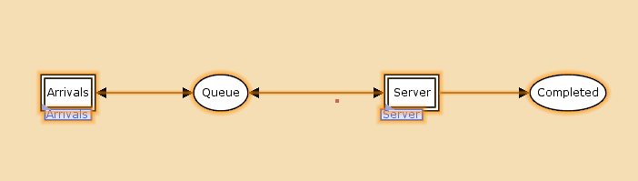{#fig:001 width=70%}

#

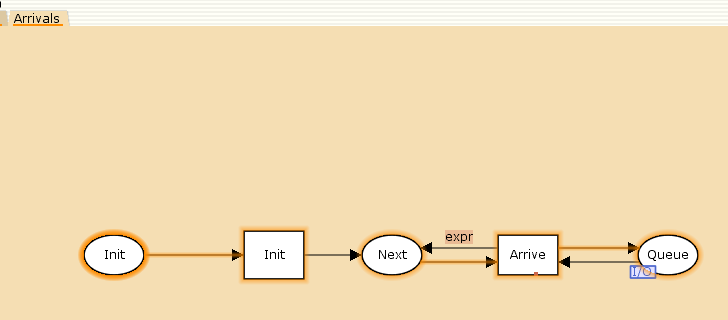{#fig:002 width=70%}

#

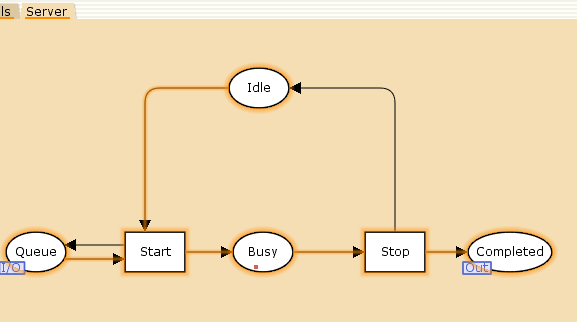{#fig:003 width=70%}


#

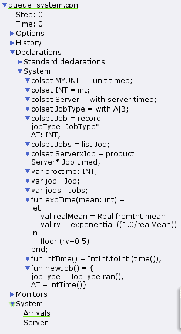{#fig:004 width=70%}

#

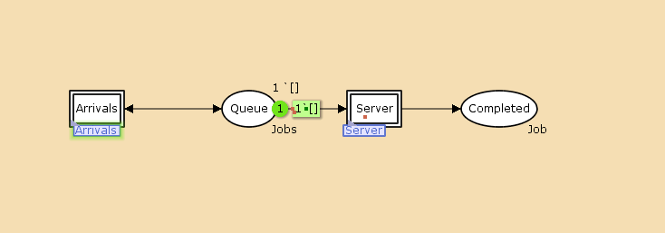{#fig:005 width=70%}

#

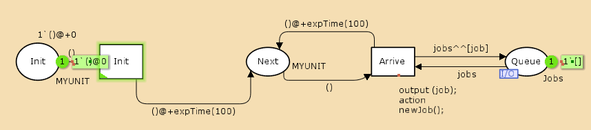{#fig:006 width=70%}

#

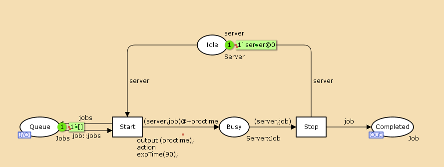{#fig:007 width=70%}

# Мониторинг параметров моделируемой системы

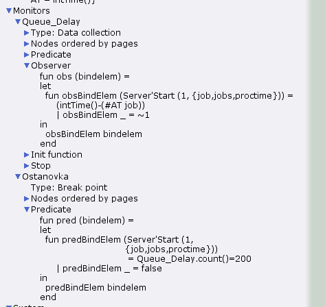{#fig:008 width=70%}

#

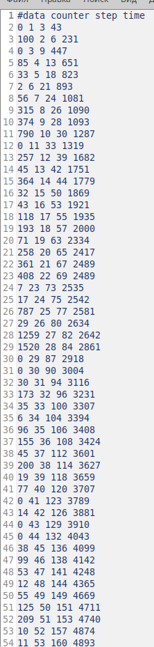{#fig:009 width=70%}

#

```
#!/usr/bin/gnuplot -persist

set encoding utf8
set term pngcairo font "Helvetica,9"

set out 'win_1.png'
plot "Queue_Delay.log" using ($4):($1) with lines
```

#

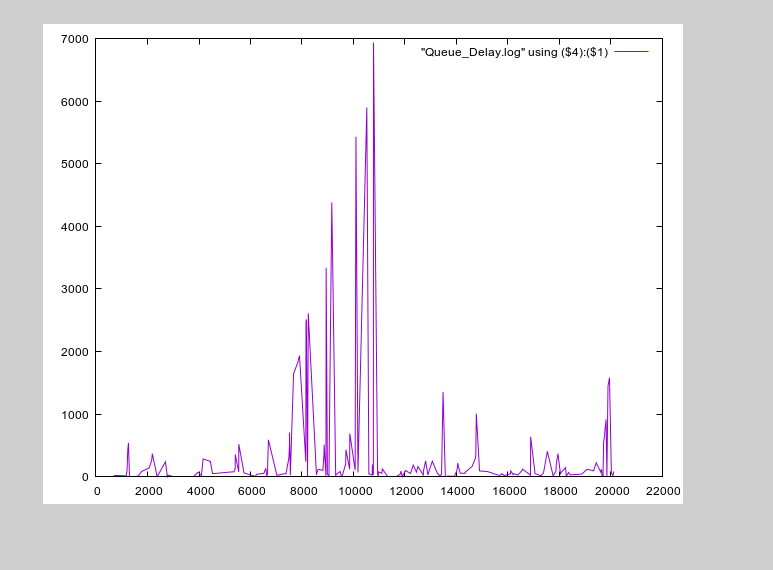{#fig:010 width=70%}

#

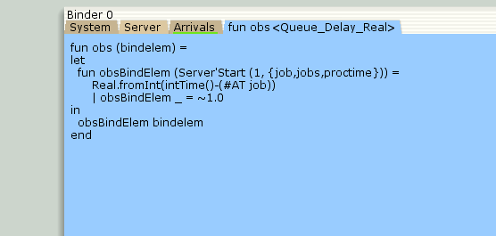{#fig:011 width=70%}

#

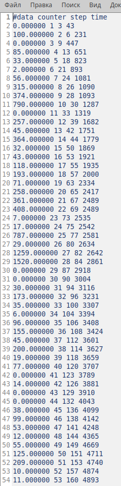{#fig:012 width=70%}

#

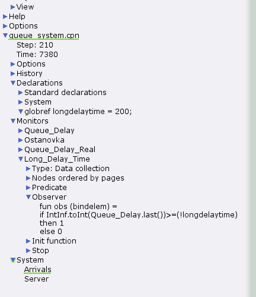{#fig:013 width=70%}

#

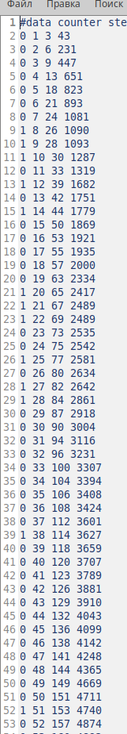{#fig:014 width=70%}

#

```
#!/usr/bin/gnuplot -persist
set encoding utf8
set term pngcairo font "Helvetica,9"

set out 'win_3.png'
set style line 2
plot [0:] [0:1.2] "Long_Delay_Time.log" using ($4):($1) with lines
```

#

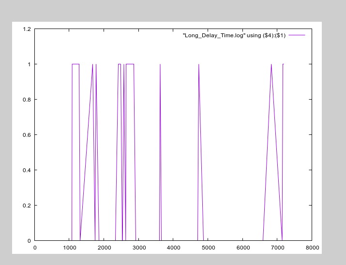{#fig:014 width=70%}

# Выводы

В процессе выполнения данной лабораторной работы я реализовала модель системы массового обслуживания M|M|1 в CPN Tools.