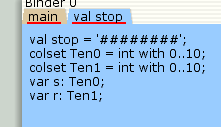
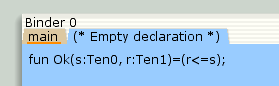
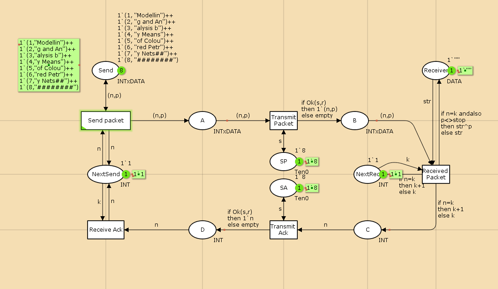

---
## Front matter
lang: ru-RU
title:  "Лабораторная работа 12"
subtitle: "Пример моделирования простого протокола передачи данных"
author:
  - Извекова Мария Петровна
institute:
  - Российский университет дружбы народов, Москва, Россия
date: 19 апрель 2025

## i18n babel
babel-lang: russian
babel-otherlangs: english

## Formatting pdf
toc: false
toc-title: Содержание
slide_level: 2
aspectratio: 169
section-titles: true
theme: metropolis
header-includes:
 - \metroset{progressbar=frametitle,sectionpage=progressbar,numbering=fraction}
---

# Докладчик

:::::::::::::: {.columns align=center}
::: {.column width="70%"}

  * Извекова Мария Петровна
  * студентка 3-го курса
  * Российский университет дружбы народов
  * [1132226460@pfur.ru](mailto:1132226460@pfur.ru)

:::
::: {.column width="30%"}

:::
::::::::::::::

# Цель работы

Реализовать простой протокол передачи данных в CPN Tools.

# Задание

1. Реализовать простой протокол передачи данных в CPN Tools.
2. Вычислить пространство состояний, сформировать отчет о нем и построить граф.

# Выполнение лабораторной работы

{#fig:001 width=50%}

#

{#fig:002 width=70%}

#

{#fig:003 width=70%}

#
::: columns
::: column
{#fig:004 width=70%}
::::

::: column
{#fig:005 width=70%}
::: 
:::

#

{#fig:006 width=70%}

#

{#fig:007 width=70%}

# Упражнение

{#fig:008 width=70%}

#

{#fig:009 width=70%}

# Вывод

В процессе выполнения данной лабораторной работы я реализовала простой протокол передачи данных в CPN Tools и проведен анализ его пространства состояний.

# Библиография

1. Зайцев Д. А., Шмелева Т. Р. Моделирование телекоммуникационных систем
в CPN Tools. — Одесса : Одесская национальная академия связи им. А.С. Попова,
2008.

2. CPN Tool. — 2014. — URL: http://cpntools.org.

