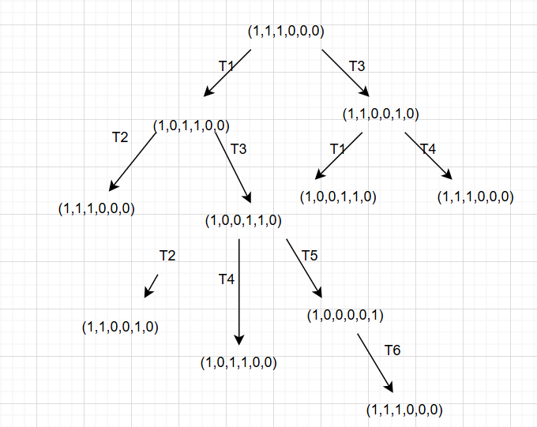
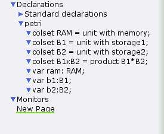
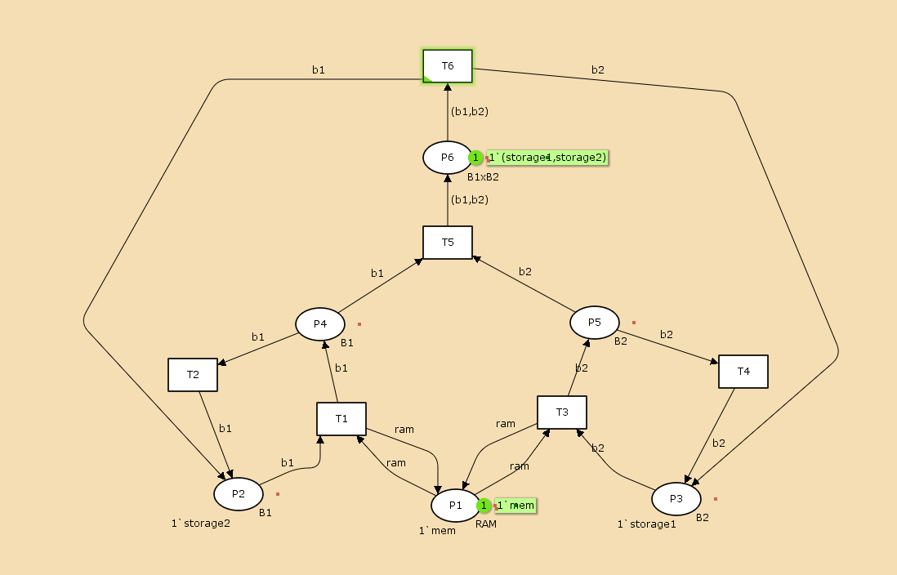
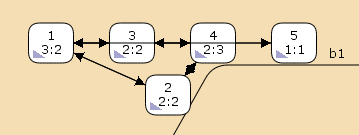
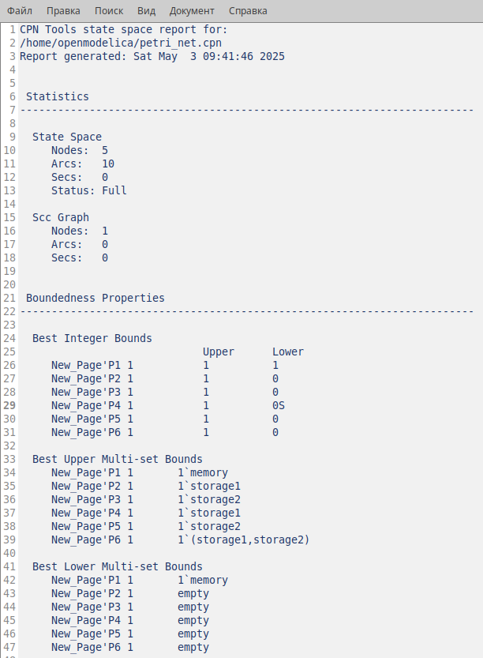

---
## Front matter
lang: ru-RU
title:  "Лабораторная работа 13"
subtitle: "Задание для самостоятельного выполнения"
author:
  - Извекова Мария Петровна
institute:
  - Российский университет дружбы народов, Москва, Россия
date: 3 мая 2025

## i18n babel
babel-lang: russian
babel-otherlangs: english

## Formatting pdf
toc: false
toc-title: Содержание
slide_level: 2
aspectratio: 169
section-titles: true
theme: metropolis
header-includes:
 - \metroset{progressbar=frametitle,sectionpage=progressbar,numbering=fraction}
---

# Докладчик

:::::::::::::: {.columns align=center}
::: {.column width="70%"}

  * Извекова Мария Петровна
  * студентка 3-го курса
  * Российский университет дружбы народов
  * [1132226460@pfur.ru](mailto:1132226460@pfur.ru)

:::
::: {.column width="30%"}

:::
::::::::::::::

# Цель работы

Задача для самостоятельного выполнения

# Задание

1. Используя теоретические методы анализа сетей Петри, проведите анализ сети (с помощью построения дерева достижимости). Определите, является ли сеть безопасной, ограниченной, сохраняющей, имеются ли тупики.
2. Промоделируйте сеть Петри с помощью CPNTools.
3. Вычислите пространство состояний. Сформируйте отчёт о пространстве состояний и проанализируйте его. Постройте граф пространства состояний.

# Схема и описание модели

Сеть Петри моделируемой системы представлена на рис. [-@fig:001].
Множество позиций:
P1 — состояние оперативной памяти (свободна / занята);
P2 — состояние внешнего запоминающего устройства B1 (свободно / занято);
P3 — состояние внешнего запоминающего устройства B2 (свободно / занято);
P4 — работа на ОП и B1 закончена;
P5 — работа на ОП и B2 закончена;
P6 — работа на ОП, B1 и B2 закончена;

Множество переходов:
T1 — ЦП работает только с RAM и B1;
T2 — обрабатываются данные из RAM и с B1 переходят на устройство вывода;
T3 — CPU работает только с RAM и B2;
T4 — обрабатываются данные из RAM и с B2 переходят на устройство вывода;
T5 — CPU работает только с RAM и с B1, B2;
T6 — обрабатываются данные из RAM, B1, B2 и переходят на устройство вывода

#

{#fig:001 width=70%}

# Анализ сети Петри

{#fig:002 width=70%}

# Реализация в CPNTOOLS

{#fig:003 width=70%}

# 

{#fig:004 width=70%}

#

{#fig:005 width=70%}

#

{#fig:006 width=70%}

#

::: columns
::: column
{#fig:007 width=50%}
:::

::: column
{#fig:008 width=60%}
::: 
:::

#

::: columns
::: column
{#fig:009 width=70%}
:::

::: column
{#fig:010 width=70%}
::: 
:::

# Вывод

В данной лабораторной работе я выполнила задание для самостоятельной работы, проанализировала сть петри, построила дерево достижимости, реализовала сеть в CPNtools,построила граф состояний и проанализировала его