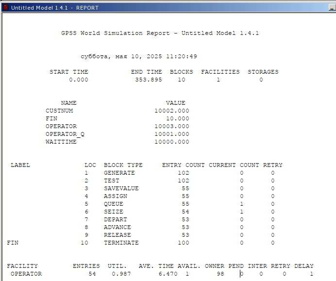
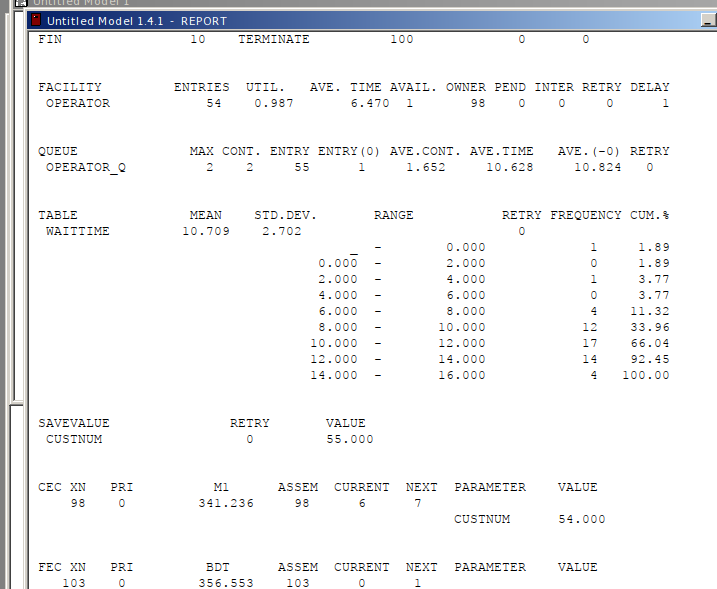
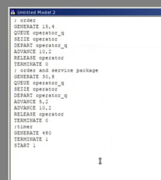
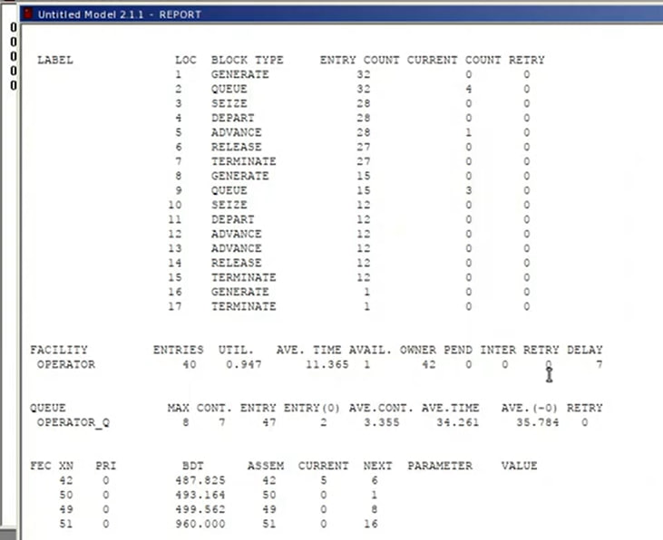
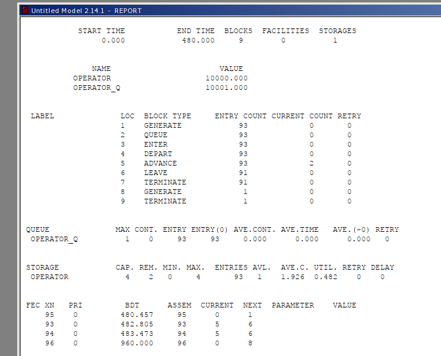

---
## Front matter
lang: ru-RU
title:  "Лабораторная работа 14"
subtitle:  "Модели обработки заказов"
author:
  - Извекова Мария Петровна
institute:
  - Российский университет дружбы народов, Москва, Россия
date: 10 мая 2025

## i18n babel
babel-lang: russian
babel-otherlangs: english

## Formatting pdf
toc: false
toc-title: Содержание
slide_level: 2
aspectratio: 169
section-titles: true
theme: metropolis
header-includes:
 - \metroset{progressbar=frametitle,sectionpage=progressbar,numbering=fraction}
---

# Докладчик

:::::::::::::: {.columns align=center}
::: {.column width="70%"}

  * Извекова Мария Петровна
  * студентка 3-го курса
  * Российский университет дружбы народов
  * [1132226460@pfur.ru](mailto:1132226460@pfur.ru)

:::
::: {.column width="30%"}

:::
::::::::::::::

# Цель работы

Построить модели несколько моделей в GPSS и проанализировать их отчеты

# Задание

Построить модели:
1. Модель оформления заказов клиентов одним оператором
2. Построение гистограммы распределения заявок в очереди
3. Модель обслуживания двух типов заказов от клиентов
в интернет-магазине
4. Модель оформления заказов несколькими операторами

# Модель оформления заказов клиентов одним оператором

В интернет-магазине заказы принимает один оператор. Интервалы поступления
заказов распределены равномерно с интервалом 15 ± 4 мин. Время оформления
заказа также распределено равномерно на интервале 10 ± 2 мин. Обработка поступивших заказов происходит в порядке очереди (FIFO). Требуется разработать
модель обработки заказов в течение 8 часов.

#

{#fig:001 width=70%}

# 

{#fig:002 width=70%}

# Упражнение. 

Скорректируйте модель в соответствии с изменениями входных
данных: интервалы поступления заказов распределены равномерно с интервалом
3.14 ± 1.7 мин; время оформления заказа также распределено равномерно на интервале 6.66 ± 1.7 мин.

# 

::: columns
::: column
{#fig:003 width=70%}
:::

::: column
{#fig:004 width=70%}
::: 
:::

#  Построение гистограммы распределения заявок в очереди

Предположим требуется построить гистограмму распределения заявок, ожидающих обработки в очереди в примере из предыдущего упражнения. Для построения
гистограммы необходимо сформировать таблицу значений заявок в очереди, записываемых в неё с определённой частотой.
Команда описания такой таблицы QTABLE имеет следующий формат:
Name QTABLE A,B,C,D
Здесь Name — метка, определяющая имя таблицы. Далее должны быть заданы
операнды: А задается элемент данных, чьё частотное распределение будет заноситься
в таблицу (может быть именем, выражением в скобках или системным числовым
атрибутом (СЧА)); B задается верхний предел первого частотного интервала; С
задает ширину частотного интервала — разницу между верхней и нижней границей
каждого частотного класса; D задаёт число частотных интервалов.

#

{#fig:005 width=70%}

#

::: columns
::: column
{#fig:006 width=70%}
:::

::: column
{#fig:007 width=70%}
::: 
:::

#

{#fig:008 width=70%}

# Модель обслуживания двух типов заказов от клиентов в интернет-магазине

В интернет-магазин к одному оператору поступают два типа заявок от клиентов —
обычный заказ и заказ с оформление дополнительного пакета услуг. Заявки первого
типа поступают каждые 15 ± 4 мин. Заявки второго типа — каждые 30 ± 8 мин.
Оператор обрабатывает заявки по принципу FIFO («первым пришел — первым
обслужился»). Время, затраченное на оформление обычного заказа, составляет 10 ±
2 мин, а на оформление дополнительного пакета услуг — 5 ± 2 мин. Требуется
разработать модель обработки заказов в течение 8 часов, обеспечив сбор данных об
очереди заявок от клиентов.

# 

{#fig:008 width=70%}

#

::: columns
::: column
{#fig:006 width=70%}
:::

::: column
{#fig:007 width=70%}
::: 
:::

#  Упражнение 

Скорректируйте модель так, чтобы учитывалось условие, что число
заказов с дополнительным пакетом услуг составляет 30% от общего числа заказов.
Используйте оператор TRANSFER.

#

::: columns
::: column
{#fig:009 width=70%}
:::

::: column
{#fig:010 width=70%}
::: 
:::

#  Модель оформления заказов несколькими операторами

В интернет-магазине заказы принимают 4 оператора. Интервалы поступления заказов распределены равномерно с интервалом 5 ± 2 мин. Время оформления заказа
каждым оператором также распределено равномерно на интервале 10 ± 2 мин. Обработка поступивших заказов происходит в порядке очереди (FIFO). Требуется
определить характеристики очереди заявок на оформление заказов при условии, что
заявка может обрабатываться одним из 4-х операторов в течение восьмичасового
рабочего дня

#

::: columns
::: column
{#fig:011 width=70%}
:::

::: column
{#fig:012 width=70%}
::: 
:::

# Упражнение

Изменим модель: требуется учесть в ней возможные отказы клиентов от заказа -- когда при подаче заявки на заказ клиент видит в очереди более двух других заявок, он отказывается от подачи заявки, то есть отказывается от обслуживания (используем блок TEST и стандартный числовой атрибут Qj текущей длины очереди j).

#

::: columns
::: column
{#fig:013 width=70%}
:::

::: column
{#fig:014 width=70%}
::: 
:::

# Выводы
В результате была реализована с помощью gpss:

модель оформления заказов клиентов одним оператором;
построение гистограммы распределения заявок в очереди;
модель обслуживания двух типов заказов от клиентов в интернет-магазине;
модель оформления заказов несколькими операторами.

# Библиография

1. Королькова А. В., Кулябов Д. С. Модели обработки заказов

2. Королькова А. В., Кулябов Д. С. Имитационное моделирование в GPSS