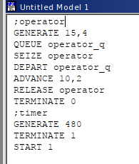
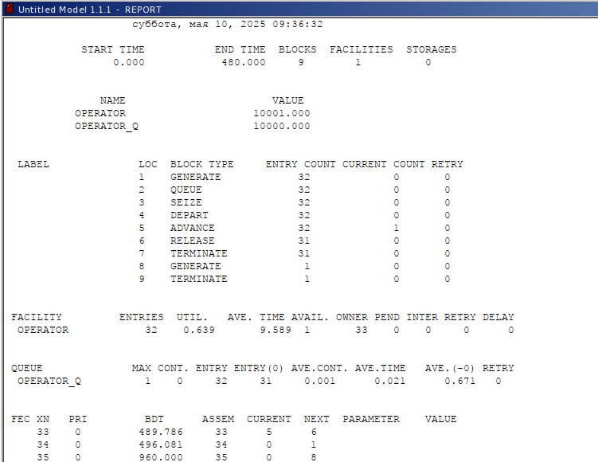
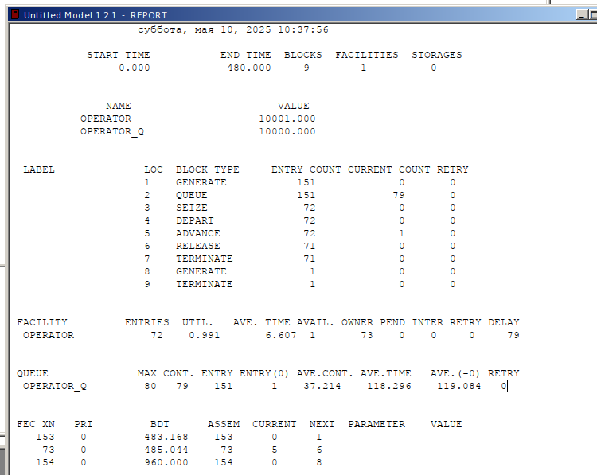
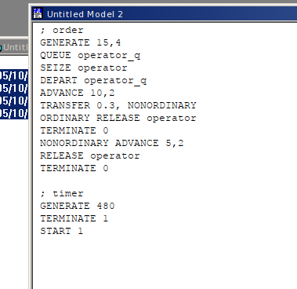
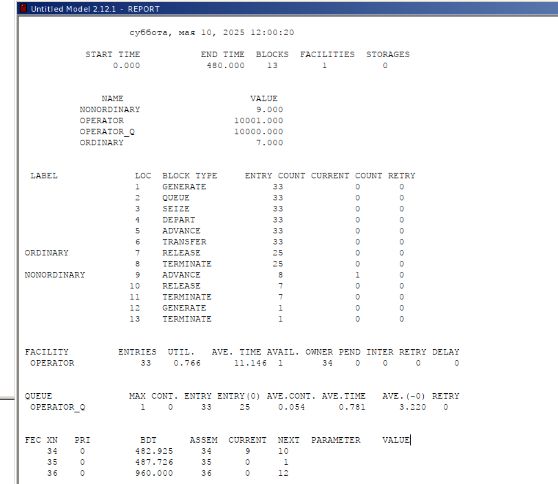
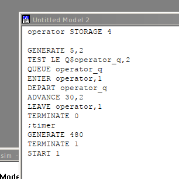
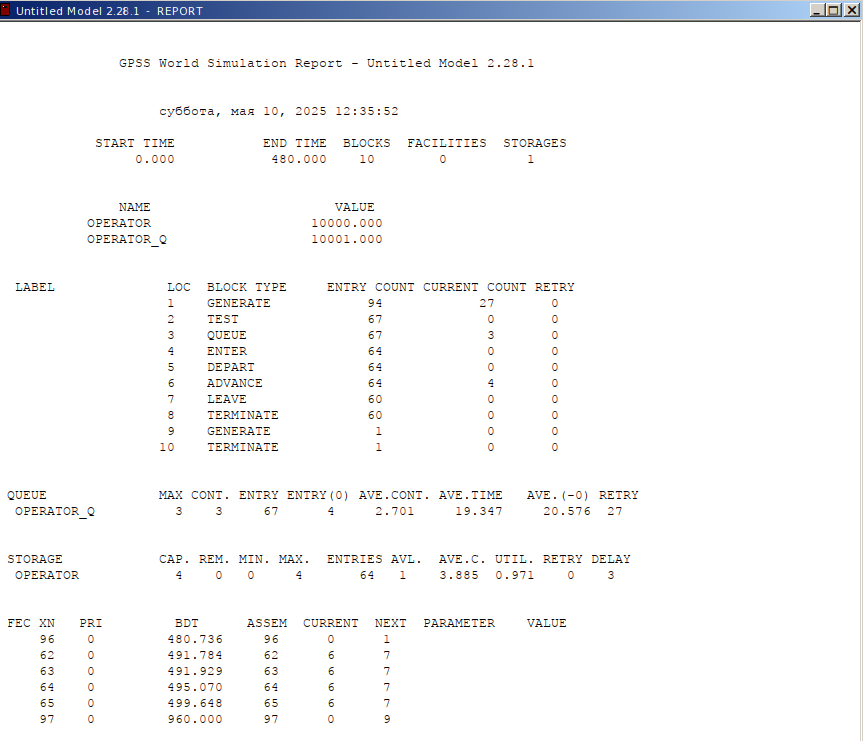

---
## Front matter
title: "Лабораторная работа 14"
subtitle:   "Модели обработки заказов"
author: "Извекова Мария Петровна"

## Generic otions
lang: ru-RU
toc-title: "Содержание"

## Bibliography
bibliography: bib/cite.bib
csl: pandoc/csl/gost-r-7-0-5-2008-numeric.csl

## Pdf output format
toc: true # Table of contents
toc-depth: 2
lof: true # List of figures
lot: true # List of tables
fontsize: 12pt
linestretch: 1.5
papersize: a4
documentclass: scrreprt
## I18n polyglossia
polyglossia-lang:
  name: russian
  options:
	- spelling=modern
	- babelshorthands=true
polyglossia-otherlangs:
  name: english
## I18n babel
babel-lang: russian
babel-otherlangs: english
## Fonts
mainfont: IBM Plex Serif
romanfont: IBM Plex Serif
sansfont: IBM Plex Sans
monofont: IBM Plex Mono
mathfont: STIX Two Math
mainfontoptions: Ligatures=Common,Ligatures=TeX,Scale=0.94
romanfontoptions: Ligatures=Common,Ligatures=TeX,Scale=0.94
sansfontoptions: Ligatures=Common,Ligatures=TeX,Scale=MatchLowercase,Scale=0.94
monofontoptions: Scale=MatchLowercase,Scale=0.94,FakeStretch=0.9
mathfontoptions:
## Biblatex
biblatex: true
biblio-style: "gost-numeric"
biblatexoptions:
  - parentracker=true
  - backend=biber
  - hyperref=auto
  - language=auto
  - autolang=other*
  - citestyle=gost-numeric
## Pandoc-crossref LaTeX customization
figureTitle: "Рис."
listingTitle: "Листинг"
lofTitle: "Список иллюстраций"
lolTitle: "Листинги"
## Misc options
indent: true
header-includes:
  - \usepackage{indentfirst}
  - \usepackage{float} # keep figures where there are in the text
  - \floatplacement{figure}{H} # keep figures where there are in the text
---

# Цель работы

Построить модели несколько моделей в GPSS и проанализировать их отчеты

# Задание

Построить модели:
1. Модель оформления заказов клиентов одним оператором
2. Построение гистограммы распределения заявок в очереди
3. Модель обслуживания двух типов заказов от клиентов
в интернет-магазине
4. Модель оформления заказов несколькими операторами

# Модель оформления заказов клиентов одним оператором

В интернет-магазине заказы принимает один оператор. Интервалы поступления
заказов распределены равномерно с интервалом 15 ± 4 мин. Время оформления
заказа также распределено равномерно на интервале 10 ± 2 мин. Обработка поступивших заказов происходит в порядке очереди (FIFO). Требуется разработать
модель обработки заказов в течение 8 часов.

Порядок блоков в модели соответствует порядку фаз обработки заказа в реальной
системе:
1) клиент оставляет заявку на заказ в интернет-магазине;
2) если необходимо, заявка от клиента ожидает в очереди освобождения оператора
для оформления заказа;
3) заявка от клиента принимается оператором для оформления заказа;
4) оператор оформляет заказ;
5) клиент получает подтверждение об оформлении заказа (покидает систему).

Для задания равномерного распределения поступления заказов используем блок
GENERATE, для задания равномерного времени обслуживания (задержки в системе)
— ADVANCE. Для моделирования ожидания заявок клиентов в очереди используем
блоки QUEUE и DEPART, в которых в качестве имени очереди укажем operator_q
Для моделирования поступления заявок для оформления заказов к оператору используем блоки SEIZE и RELEASE с параметром operator — имени «устройства
обслуживания».  рис. [-@fig:001]

Требуется, чтобы модельное время было 8 часов. Соответственно, параметр блока
GENERATE — 480 (8 часов по 60 минут, всего 480 минут). Работа программы начинается с оператора START с начальным значением счётчика завершений, равным 1;
заканчивается — оператором TERMINATE с параметром 1, что задаёт ординарность
потока в модели.

{#fig:001 width=70%}

После запуска симуляции получаем отчёт рис. [-@fig:002]
Результаты работы модели:
– модельное время в начале моделирования: START TIME=0.0;
– абсолютное время или момент, когда счетчик завершений принял значение 0:
END TIME=480.0;
– количество блоков, использованных в текущей модели, к моменту завершения
моделирования: BLOCKS=9;
– количество одноканальных устройств, использованных в модели к моменту завершения моделирования: FACILITIES=1;
– количество многоканальных устройств, использованных в текущей модели к моменту завершения моделирования: STORAGES=0.
Имена, используемые в программе модели: operator, operator_q.
Далее идёт информация о блоках текущей модели, в частности, ENTRY COUNT —
количество транзактов, вошедших в блок с начала процедуры моделирования.
Затем идёт информация об одноканальном устройстве FACILITY (оператор,
оформляющий заказ), откуда видим, что к оператору попало 33 заказа от клиентов
(значение поля OWNER=33), но одну заявку оператор не успел принять в обработку
до окончания рабочего времени (значение поля ENTRIES=32). Полезность работы
оператора составила 0, 639. При этом среднее время занятости оператора составило
9, 589 мин

Далее информация об очереди:
– QUEUE=operator_q — имя объекта типа «очередь»;
– MAX=1 — в очереди находилось не более одной ожидающей заявки от клиента;
– CONT=0 — на момент завершения моделирования очередь была пуста;
– ENTRIES=32 — общее число заявок от клиентов, прошедших через очередь в течение периода моделирования;
– ENTRIES(O)=31 — число заявок от клиентов, попавших к оператору без ожидания
в очереди;
– AVE.CONT=0, 001 заявок от клиентов в среднем были в очереди;
– AVE.TIME=0.021 минут в среднем заявки от клиентов провели в очереди (с учётом
всех входов в очередь);
– AVE.(–0)=0, 671 минут в среднем заявки от клиентов провели в очереди (без
учета «нулевых» входов в очередь).
В конце отчёта идёт информация о будущих событиях:
– XN=33 — порядковый номер заявки от клиента, ожидающей поступления для
оформления заказа у оператора;
– PRI=0 — все клиенты (из заявки) равноправны;
– BDT=489, 786 — время назначенного события, связанного с данным транзактом;
– ASSEM=33 — номер семейства транзактов;
– CURRENT=5 — номер блока, в котором находится транзакт;
– NEXT=6 — номер блока, в который должен войти транзакт.

{#fig:002 width=70%}

# Упражнение. 
Скорректируйте модель в соответствии с изменениями входных
данных: интервалы поступления заказов распределены равномерно с интервалом
3.14 ± 1.7 мин; время оформления заказа также распределено равномерно на интервале 6.66 ± 1.7 мин.

{#fig:003 width=70%}

{#fig:004 width=70%}

Результаты работы модели:

модельное время в начале моделирования: START TIME=0.0;
абсолютное время или момент, когда счетчик завершений принял значение 0: END TIME=480.0;
количество блоков, использованных в текущей модели, к моменту завершения моделирования: BLOCKS=9;
количество одноканальных устройств, использованных в модели к моменту завершения моделирования: FACILITIES=1;
количество многоканальных устройств, использованных в текущей модели к моменту завершения моделирования: STORAGES=0.
Имена, используемые в программе модели: operator, operator_q.

количество транзактов, вошедших в блок с начала процедуры моделирования ENTRY COUNT = 152;
Затем идёт информация об одноканальном устройстве FACILITY (оператор, оформляющий заказ), откуда видим, что к оператору попало 71 заказ от клиентов (значение поля OWNER=71), но оператор успел принять в обработку до окончания рабочего времени только 70 (значение поля ENTRIES=70). Полезность работы оператора составила 0,991. При этом среднее время занятости оператора составило 6,796 мин.

Далее информация об очереди:

QUEUE=operator_q -- имя объекта типа «очередь»;
MAX=82 -- в очереди находилось 82 ожидающих заявок от клиента;
CONT=82 -- на момент завершения моделирования в очереди было 82 заявки;
ENTRIES=82 -- общее число заявок от клиентов, прошедших через очередь в течение периода моделирования;
ENTRIES(O)=1 -- число заявок от клиентов, попавших к оператору без ожидания в очереди;
AVE.CONT=39,096 заявок от клиентов в среднем были в очереди;
AVE.TIME=123.461 минут в среднем заявки от клиентов провели в очереди (с учётом всех входов в очередь);
AVE.(-0)=123,279 минут в среднем заявки от клиентов провели в очереди (без учета «нулевых» входов в очередь).
В конце отчёта идёт информация о будущих событиях.

# Построение гистограммы распределения заявок в очереди

Предположим требуется построить гистограмму распределения заявок, ожидающих обработки в очереди в примере из предыдущего упражнения. Для построения
гистограммы необходимо сформировать таблицу значений заявок в очереди, записываемых в неё с определённой частотой.
Команда описания такой таблицы QTABLE имеет следующий формат:
Name QTABLE A,B,C,D
Здесь Name — метка, определяющая имя таблицы. Далее должны быть заданы
операнды: А задается элемент данных, чьё частотное распределение будет заноситься
в таблицу (может быть именем, выражением в скобках или системным числовым
атрибутом (СЧА)); B задается верхний предел первого частотного интервала; С
задает ширину частотного интервала — разницу между верхней и нижней границей
каждого частотного класса; D задаёт число частотных интервалов. рис. [-@fig:005]

{#fig:005 width=70%}

Здесь Waittime — метка оператора таблицы очередей QTABLE, в данном случае
название таблицы очереди заявок на заказы. Строка с оператором TEST по смыслу
аналогично действиям оператора IF и означает, что если в очереди 0 или 1 заявка,
то осуществляется переход к следующему оператору, в данном случае к оператору
SAVEVALUE, в противном случае (в очереди более одной заявки) происходит переход
к оператору с меткой Fin, то есть заявка удаляется из системы, не попадая на
обслуживание.
Строка с оператором SAVEVALUE с помощью операнда Custnum подсчитывает
число заявок на заказ, попавших в очередь. Далее оператору ASSIGN присваивается
значение СЧА оператора Custnum.

{#fig:006 width=70%}

{#fig:007 width=70%}

Результаты работы модели:

модельное время в начале моделирования: START TIME=0.0;
абсолютное время или момент, когда счетчик завершений принял значение 0: END TIME=353.895;
количество блоков, использованных в текущей модели, к моменту завершения моделирования: BLOCKS=10;
количество одноканальных устройств, использованных в модели к моменту завершения моделирования: FACILITIES=1;
количество многоканальных устройств, использованных в текущей модели к моменту завершения моделирования: STORAGES=0.
Имена, используемые в программе модели: operator, operator_q.

количество транзактов, вошедших в блок с начала процедуры моделирования ENTRY COUNT = 102;
Затем идёт информация об одноканальном устройстве FACILITY (оператор, оформляющий заказ), откуда видим, что к оператору попало 98 заказов от клиентов (значение поля OWNER=98), но оператор успел принять в обработку до окончания рабочего времени только 54 (значение поля ENTRIES=54). Полезность работы оператора составила 0,987. При этом среднее время занятости оператора составило 6,470 мин.

Далее информация об очереди:

QUEUE=operator_q -- имя объекта типа «очередь»;
MAX=2 -- в очереди находилось не более двух ожидающих заявок от клиента;
CONT=2 -- на момент завершения моделирования в очереди было два клиента;
ENTRIES=55 -- общее число заявок от клиентов, прошедших через очередь в течение периода моделирования;
ENTRIES(O)=1 -- число заявок от клиентов, попавших к оператору без ожидания в очереди;
AVE.CONT=1,652 заявок от клиентов в среднем были в очереди;
AVE.TIME=10.628 минут в среднем заявки от клиентов провели в очереди (с учётом всех входов в очередь);
AVE.(-0)=10,824 минут в среднем заявки от клиентов провели в очереди (без учета «нулевых» входов в очередь).

{#fig:008 width=70%}

Частотность разделена на 15 частотных интервалов с шагом 2 и началом в 0, как мы и задали. Наибольшее количество заявок (17) обрабатывалось 10-12 минут, 14 заявок -- 12-14 минут, 12 заявок -- 8-10 минут, в остальных диапазонах 0-4 заявок.

# Модель обслуживания двух типов заказов от клиентов в интернет-магазине

В интернет-магазин к одному оператору поступают два типа заявок от клиентов —
обычный заказ и заказ с оформление дополнительного пакета услуг. Заявки первого
типа поступают каждые 15 ± 4 мин. Заявки второго типа — каждые 30 ± 8 мин.
Оператор обрабатывает заявки по принципу FIFO («первым пришел — первым
обслужился»). Время, затраченное на оформление обычного заказа, составляет 10 ±
2 мин, а на оформление дополнительного пакета услуг — 5 ± 2 мин. Требуется
разработать модель обработки заказов в течение 8 часов, обеспечив сбор данных об
очереди заявок от клиентов.

Необходимо реализовать отличие в оформлении обычных заказов и заказов с дополнительным пакетом услуг. Такую систему можно промоделировать с помощью двух
сегментов. Один из них моделирует оформление обычных заказов, а второй — заказов с дополнительным пакетом услуг. В каждом из сегментов пара QUEUE–DEPART
должна описывать одну и ту же очередь, а пара блоков SEIZE–RELEASE должна
описывать в каждом из двух сегментов одно и то же устройство и моделировать
работу оператора.

{#fig:015 width=70%}

{#fig:016 width=70%}

Результаты работы модели:

модельное время в начале моделирования: START TIME=0.0;
абсолютное время или момент, когда счетчик завершений принял значение 0: END TIME=480.0;
количество блоков, использованных в текущей модели, к моменту завершения моделирования: BLOCKS=17;
количество одноканальных устройств, использованных в модели к моменту завершения моделирования: FACILITIES=1;
количество многоканальных устройств, использованных в текущей модели к моменту завершения моделирования: STORAGES=0.
Имена, используемые в программе модели: operator, operator_q.

количество транзактов, вошедших в блок первого типа заказов с начала процедуры моделирования ENTRY COUNT = 32, а второго типа(с дополнительными услугами) ENTRY COUNT = 15; обработано 12+27 = 39;
Затем идёт информация об одноканальном устройстве FACILITY (оператор, оформляющий заказ), откуда видим, что к оператору попало 42 заказ от клиентов (значение поля OWNER=42), но оператор успел принять в обработку до окончания рабочего времени только 40 (значение поля ENTRIES=40). Полезность работы оператора составила 0,947. При этом среднее время занятости оператора составило 11,365 мин.

Далее информация об очереди:

QUEUE=operator_q -- имя объекта типа «очередь»;
MAX=8 -- в очереди находилось не более двух ожидающих заявок от клиента;
CONT=7 -- на момент завершения моделирования в очереди было 7 клиентов;
ENTRIES=47 -- общее число заявок от клиентов, прошедших через очередь в течение периода моделирования;
``ENTRIES(O)`=2 -- число заявок от клиентов, попавших к оператору без ожидания в очереди;
AVE.CONT=3,355 заявок от клиентов в среднем были в очереди;
AVE.TIME=34,261 минут в среднем заявки от клиентов провели в очереди (с учётом всех входов в очередь);
AVE.(-0)=35,784 минут в среднем заявки от клиентов провели в очереди (без учета «нулевых» входов в очередь).
В конце отчёта идёт информация о будущих событиях.

# Упражнение 

Скорректируйте модель так, чтобы учитывалось условие, что число
заказов с дополнительным пакетом услуг составляет 30% от общего числа заказов.
Используйте оператор TRANSFER.

{#fig:009 width=70%}

{#fig:010 width=70%}

Результаты работы модели:

модельное время в начале моделирования: START TIME=0.0;
абсолютное время или момент, когда счетчик завершений принял значение 0: END TIME=480.0;
количество блоков, использованных в текущей модели, к моменту завершения моделирования: BLOCKS=11;
количество одноканальных устройств, использованных в модели к моменту завершения моделирования: FACILITIES=1;
количество многоканальных устройств, использованных в текущей модели к моменту завершения моделирования: STORAGES=0.
Имена, используемые в программе модели: operator, operator_q.

количество транзактов, вошедших в блок заказов с начала процедуры моделирования ENTRY COUNT = 33, при этом из них второго типа (с дополнительными услугами) ENTRY COUNT = 8; обработано 32 заказа;
Затем идёт информация об одноканальном устройстве FACILITY (оператор, оформляющий заказ), откуда видим, что к оператору попало 34 заказа от клиентов (значение поля OWNER=34), но оператор успел принять в обработку до окончания рабочего времени только 33 (значение поля ENTRIES=33). Полезность работы оператора составила 0,766. При этом среднее время занятости оператора составило 11,146 мин.

Далее информация об очереди:

QUEUE=operator_q -- имя объекта типа «очередь»;
MAX=1 -- в очереди находилось не более двух ожидающих заявок от клиента;
CONT=0 -- на момент завершения моделирования в очереди было ноль клиентов;
ENTRIES=33 -- общее число заявок от клиентов, прошедших через очередь в течение периода моделирования;
ENTRIES(O)=25 -- число заявок от клиентов, попавших к оператору без ожидания в очереди;
AVE.CONT=0,054 заявок от клиентов в среднем были в очереди;
AVE.TIME=0.781 минут в среднем заявки от клиентов провели в очереди (с учётом всех входов в очередь);
AVE.(-0)=3,220 минут в среднем заявки от клиентов провели в очереди (без учета «нулевых» входов в очередь).
В конце отчёта идёт информация о будущих событиях.

#  Модель оформления заказов несколькими операторами

В интернет-магазине заказы принимают 4 оператора. Интервалы поступления заказов распределены равномерно с интервалом 5 ± 2 мин. Время оформления заказа
каждым оператором также распределено равномерно на интервале 10 ± 2 мин. Обработка поступивших заказов происходит в порядке очереди (FIFO). Требуется
определить характеристики очереди заявок на оформление заказов при условии, что
заявка может обрабатываться одним из 4-х операторов в течение восьмичасового
рабочего дня.

{#fig:011 width=70%}

{#fig:012 width=70%}

Результаты работы модели:

модельное время в начале моделирования: START TIME=0.0;
абсолютное время или момент, когда счетчик завершений принял значение 0: END TIME=480.0;
количество блоков, использованных в текущей модели, к моменту завершения моделирования: BLOCKS=9;
количество одноканальных устройств, использованных в модели к моменту завершения моделирования: FACILITIES=1;
количество многоканальных устройств, использованных в текущей модели к моменту завершения моделирования: STORAGES=0.
Имена, используемые в программе модели: operator, operator_q.

количество транзактов, вошедших в блок заказов с начала процедуры моделирования ENTRY COUNT = 93; обработан 91 заказ;
Далее информация об очереди:

QUEUE=operator_q -- имя объекта типа «очередь»;
MAX=1 -- в очереди находилось не более двух ожидающих заявок от клиента;
CONT=0 -- на момент завершения моделирования в очереди было ноль клиентов;
ENTRIES=93 -- общее число заявок от клиентов, прошедших через очередь в течение периода моделирования;
ENTRIES(O)=93 -- число заявок от клиентов, попавших к оператору без ожидания в очереди;
AVE.CONT=0,000 -- заявок от клиентов в среднем были в очереди;
AVE.TIME=0.000 минут в среднем заявки от клиентов провели в очереди (с учётом всех входов в очередь);
AVE.(-0)=0,000 минут в среднем заявки от клиентов провели в очереди (без учета «нулевых» входов в очередь).
Затем идёт информация о многоканальном устройстве STORAGE (оператор, оформляющий заказ), откуда видим, что к операторам попало 93 заказа от клиентов, но не указано, сколько операторы успели принять в обработку. Полезность работы операторов составила 0,482. При этом среднее время занятости оператора составило 1,926 мин. Также появились значения, характерные для STORAGE: вместительность 4, максимальное число одновременно работающих операторов -- 4, минимальное -- 0.

В конце отчёта идёт информация о будущих событиях.

Упражнение

Изменим модель: требуется учесть в ней возможные отказы клиентов от заказа -- когда при подаче заявки на заказ клиент видит в очереди более двух других заявок, он отказывается от подачи заявки, то есть отказывается от обслуживания (используем блок TEST и стандартный числовой атрибут Qj текущей длины очереди j).

Добавим строчку TEST LE Q$operator_q,2, которая проверяет больше ли в очереди клиентов, чем два, если нет -- клиент поступает на обработку, иначе уходит. Также в ранее проанализированном отчете видно, что клиентов в очереди не было больше 2, поэтому увеличим время обработки заказов до 
30±2 мин., чтобы проверить результаты изменений модели.
{#fig:013 width=70%}

{#fig:014 width=70%}

Результаты работы модели:

модельное время в начале моделирования: START TIME=0.0;
абсолютное время или момент, когда счетчик завершений принял значение 0: END TIME=480.0;
количество блоков, использованных в текущей модели, к моменту завершения моделирования: BLOCKS=9;
количество одноканальных устройств, использованных в модели к моменту завершения моделирования: FACILITIES=1;
количество многоканальных устройств, использованных в текущей модели к моменту завершения моделирования: STORAGES=0.
Имена, используемые в программе модели: operator, operator_q.

количество транзактов, вошедших в блок заказов с начала процедуры моделирования ENTRY COUNT = 94; обработано 60 заказа; 27 человек отказались оставлять заявки, поскольку очередь была более 2ух заявок.
Далее информация об очереди:

QUEUE=operator_q -- имя объекта типа «очередь»;
MAX=3 -- в очереди находилось не более трех ожидающих заявок от клиента(как и было указано);
CONT=3 -- на момент завершения моделирования в очереди было ноль клиентов;
ENTRIES=67 -- общее число заявок от клиентов, прошедших через очередь в течение периода моделирования;
ENTRIES(O)=4 -- число заявок от клиентов, попавших к оператору без ожидания в очереди;
AVE.CONT=2,701 -- заявок от клиентов в среднем были в очереди;
AVE.TIME=19,347 минут в среднем заявки от клиентов провели в очереди (с учётом всех входов в очередь);
AVE.(-0)=20,576 минут в среднем заявки от клиентов провели в очереди (без учета «нулевых» входов в очередь).
Затем идёт информация о многоканальном устройстве STORAGE (оператор, оформляющий заказ), откуда видим, что к операторам попало 64 заказов от клиентов. Полезность работы операторов составила 0,971. При этом среднее время занятости оператора составило 3,885 мин. Также появились значения, характерные для STORAGE: вместительность 4, максимальное число одновременно работающих операторов -- 4, минимальное -- 0.

В конце отчёта идёт информация о будущих событиях.

# Выводы
В результате была реализована с помощью gpss:

модель оформления заказов клиентов одним оператором;
построение гистограммы распределения заявок в очереди;
модель обслуживания двух типов заказов от клиентов в интернет-магазине;
модель оформления заказов несколькими операторами.

# Библиография

1. Королькова А. В., Кулябов Д. С. Модели обработки заказов

2. Королькова А. В., Кулябов Д. С. Имитационное моделирование в GPSS

