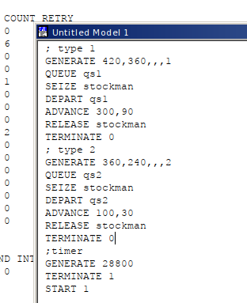
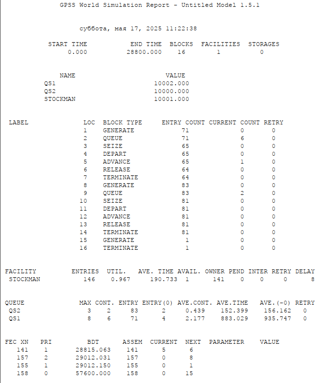
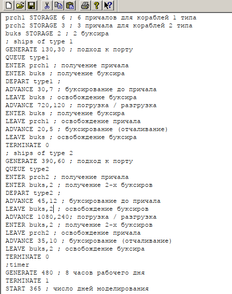
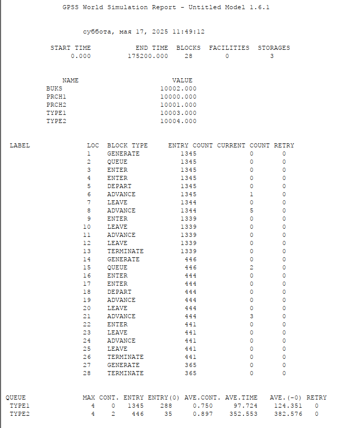
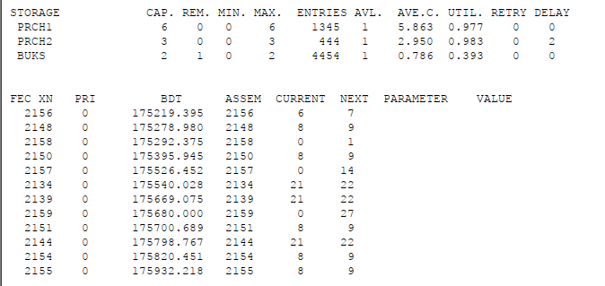

---
## Front matter
lang: ru-RU
title:  "Лабораторная работа 15"
subtitle:  "Модели обслуживания с приоритетами"
author:
  - Извекова Мария Петровна
institute:
  - Российский университет дружбы народов, Москва, Россия
date: 17 мая 2025

## i18n babel
babel-lang: russian
babel-otherlangs: english

## Formatting pdf
toc: false
toc-title: Содержание
slide_level: 2
aspectratio: 169
section-titles: true
theme: metropolis
header-includes:
 - \metroset{progressbar=frametitle,sectionpage=progressbar,numbering=fraction}
---

# Докладчик

:::::::::::::: {.columns align=center}
::: {.column width="70%"}

  * Извекова Мария Петровна
  * студентка 3-го курса
  * Российский университет дружбы народов
  * [1132226460@pfur.ru](mailto:1132226460@pfur.ru)

:::
::: {.column width="30%"}

:::
::::::::::::::

# Цель работы

Построить  модель обслуживания механиков на складе и модель обслуживания в порту судов двух типов и проанализировать их отчеты

# Задание

Построить модели:
1. модель обслуживания механиков на складе
2. Модель обслуживания в порту судов двух типов
3. Сделать анализ отчетов этих двух моделей

# Модели обслуживания с приоритетами

На фабрике на складе работает один кладовщик, который выдает запасные части
механикам, обслуживающим станки. Время, необходимое для удовлетворения запроса, зависит от типа запасной части. Запросы бывают двух категорий. Для первой
категории интервалы времени прихода механиков 420 ± 360 сек., время обслуживания — 300 ± 90 сек. Для второй категории интервалы времени прихода механиков
360 ± 240 сек., время обслуживания — 100 ± 30 сек.
Порядок обслуживания механиков кладовщиком такой: запросы первой категории
обслуживаются только в том случае, когда в очереди нет ни одного запроса второй
категории. Внутри одной категории дисциплина обслуживания — «первым пришел –
первым обслужился». Необходимо создать модель работы кладовой, моделирование
выполнять в течение восьмичасового рабочего дня.

#

{#fig:001 width=70%}

# 

{#fig:002 width=70%}

# Модель обслуживания в порту судов двух типов

Морские суда двух типов прибывают в порт, где происходит их разгрузка. В порту
есть два буксира, обеспечивающих ввод и вывод кораблей из порта. К первому
типу судов относятся корабли малого тоннажа, которые требуют использования
одного буксира. Корабли второго типа имеют большие размеры, и для их ввода
и вывода из порта требуется два буксира. Из-за различия размеров двух типов
кораблей необходимы и причалы различного размера. Кроме того, корабли имеют
различное время погрузки/разгрузки.
Требуется построить модель системы, в которой можно оценить время ожидания
кораблями каждого типа входа в порт. Время ожидания входа в порт включает время
ожидания освобождения причала и буксира. Корабль, ожидающий освобождения
причала, не обслуживается буксиром до тех пор, пока не будет предоставлен нужный
причал. Корабль второго типа не займёт буксир до тех пор, пока ему не будут
доступны оба буксира.

#

Параметры модели:
– для корабля первого типа:
– интервал прибытия: 130 ± 30 мин;
– время входа в порт: 30 ± 7 мин;
– количество доступных причалов: 6;
– время погрузки/разгрузки: 12 ± 2 час;
– время выхода из порта: 20 ± 5 мин;
– для корабля второго типа:
– интервал прибытия: 390 ± 60 мин;
– время входа в порт: 45 ± 12 мин;
– количество доступных причалов: 3;
– время погрузки/разгрузки: 18 ± 4 час;
– время выхода из порта: 35 ± 10 мин.
– время моделирования: 365 дней по 8 часов.

#

{#fig:003 width=70%}

#

::: columns
::: column
{#fig:004 width=70%}
:::

::: column
{#fig:005 width=70%}
::: 
:::

# Выводы
В результате была реализована с помощью gpss:

Модели обслуживания с приоритетами;
Модель обслуживания в порту судов двух типов;
Cделан анализ двух очтетов по данным моделям.

# Библиография

1. Королькова А. В., Кулябов Д. С. Модели обработки заказов

2. Королькова А. В., Кулябов Д. С. Имитационное моделирование в GPSS