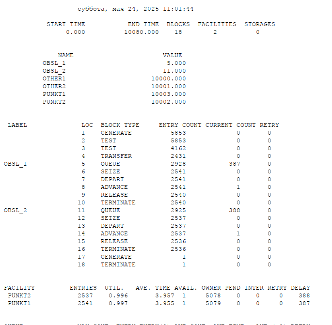
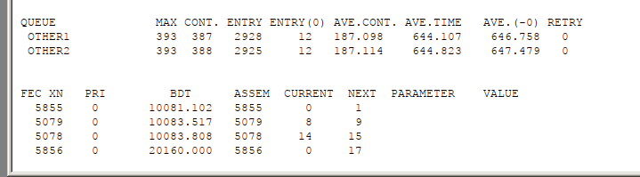
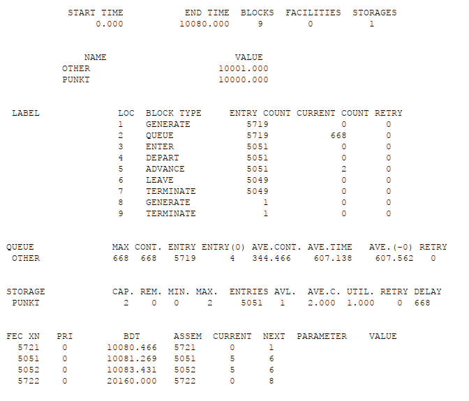
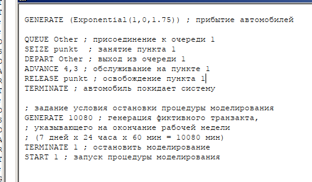
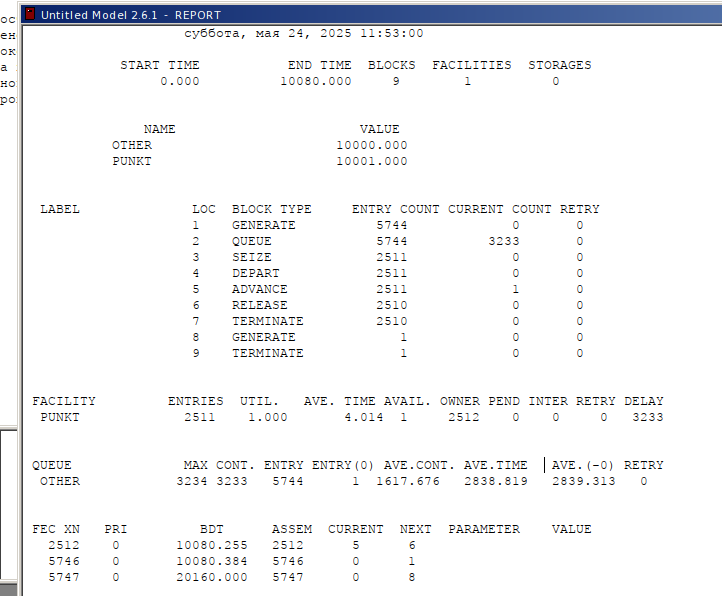
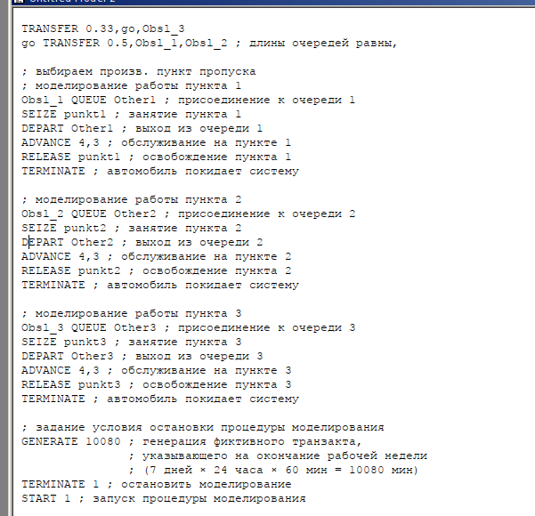
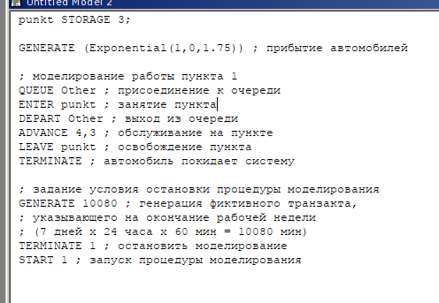
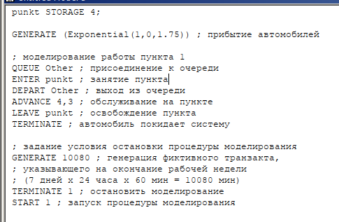

---
## Front matter
lang: ru-RU
title:  "Лабораторная работа 16"
subtitle: "Задачи оптимизации. Модель двух стратегий обслуживания"
author:
  - Извекова Мария Петровна
institute:
  - Российский университет дружбы народов, Москва, Россия
date: 17 мая 2025

## i18n babel
babel-lang: russian
babel-otherlangs: english

## Formatting pdf
toc: false
toc-title: Содержание
slide_level: 2
aspectratio: 169
section-titles: true
theme: metropolis
header-includes:
 - \metroset{progressbar=frametitle,sectionpage=progressbar,numbering=fraction}
---

# Докладчик

:::::::::::::: {.columns align=center}
::: {.column width="70%"}

  * Извекова Мария Петровна
  * студентка 3-го курса
  * Российский университет дружбы народов
  * [1132226460@pfur.ru](mailto:1132226460@pfur.ru)

:::
::: {.column width="30%"}

:::
::::::::::::::

# Цель работы

Построить  2 модели с двумя очередями обслуживания и с одной очередью обслуживания в gpss. обозначить оптимальное количество  пропускных пунктов.

# Задание

Построить модели:
1. модель с двумя очередями обсуживания
2. с одной очередью обслуживания 
3. Сделать сравнение двух моделей и обозначить оптимальное количество пропускных пунктов

# Постановка задачи

На пограничном контрольно-пропускном пункте транспорта имеются 2 пункта
пропуска. Интервалы времени между поступлением автомобилей имеют экспоненциальное распределение со средним значением µ. Время прохождения автомобилями
пограничного контроля имеет равномерное распределение на интервале [a, b].
Предлагается две стратегии обслуживания прибывающих автомобилей:
1) автомобили образуют две очереди и обслуживаются соответствующими пунктами
пропуска;
2) автомобили образуют одну общую очередь и обслуживаются освободившимся
пунктом пропуска.

# Выполнение лабораторной работы

## Построение модели

{#fig:001 width=70%}

#

::: columns
::: column
{#fig:002 width=70%}
:::

::: column
{#fig:003 width=70%}
::: 
:::

#

::: columns
::: column
{#fig:004 width=70%}
:::

::: column
{#fig:005 width=70%}
::: 
:::

# Составим таблицу по полученной статистике

| Показатель                  | стратегия 1 пункт 1 | стратегия 1 пункт 2 | стратегия 1 в целом | стратегия 2   |
|----------------------------|---------------------|---------------------|---------------------|----------------|
| Поступило автомобилей      | 2928                | 2925                | 5853                | 5719           |
| Обслужено автомобилей      | 2540                | 2536                | 5076                | 5049           |
| Коэффициент загрузки       | 0,997               | 0,996               | 0,9965              | 1              |
| Максимальная длина очереди| 393                 | 393                 | 393                 | 668            |
| Средняя длина очереди      | 187,098             | 187,114             | 374,212             | 344,466        |
| Среднее время ожидания     | 644,107             | 644,823             | 644,465             | 607,138        |

# Оптимизация модели двух стратегий обслуживания

::: columns
::: column
{#fig:006 width=70%}
:::

::: column
{#fig:007 width=70%}
::: 
:::

# 

{#fig:008 width=70%}

#

::: columns
::: column
{#fig:009 width=70%}
:::

::: column
{#fig:010 width=70%}
::: 
:::

#

{#fig:011 width=70%}

#

::: columns
::: column
{#fig:012 width=70%}
:::

::: column
{#fig:013 width=70%}
::: 
:::

#

::: columns
::: column
{#fig:014 width=70%}
:::

::: column
{#fig:015 width=70%}
::: 
:::

#

::: columns
::: column
{#fig:016 width=70%}
:::

::: column
{#fig:017 width=70%}
::: 
:::

# Выводы
В результате была реализована с помощью gpss:

1. модель с двумя очередями обсуживания
2. с одной очередью обслуживания 
3. Сделать сравнение двух моделей и обозначить оптимальное количество пропускных пунктов

# Библиография

1. Королькова А. В., Кулябов Д. С. Модели обработки заказов

2. Королькова А. В., Кулябов Д. С. Имитационное моделирование в GPSS