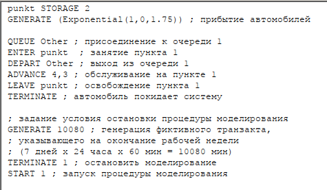
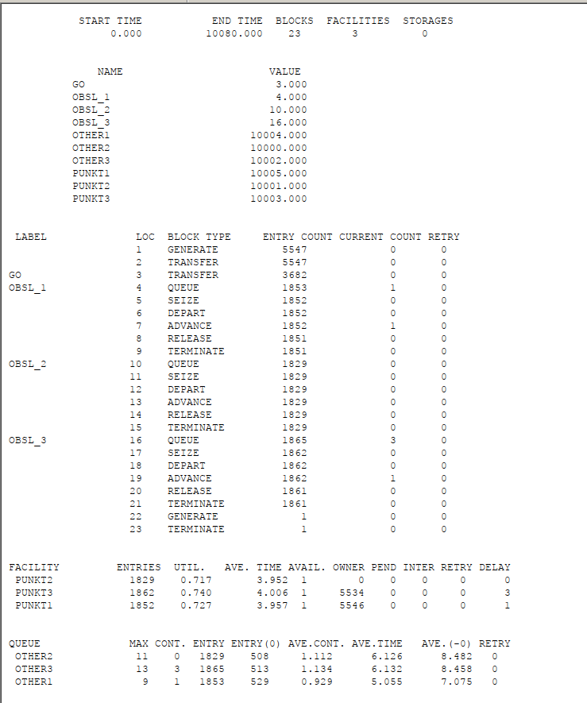
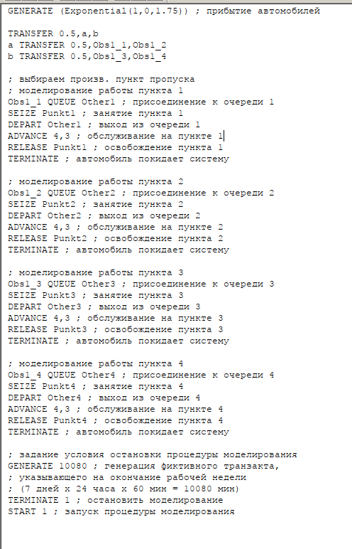
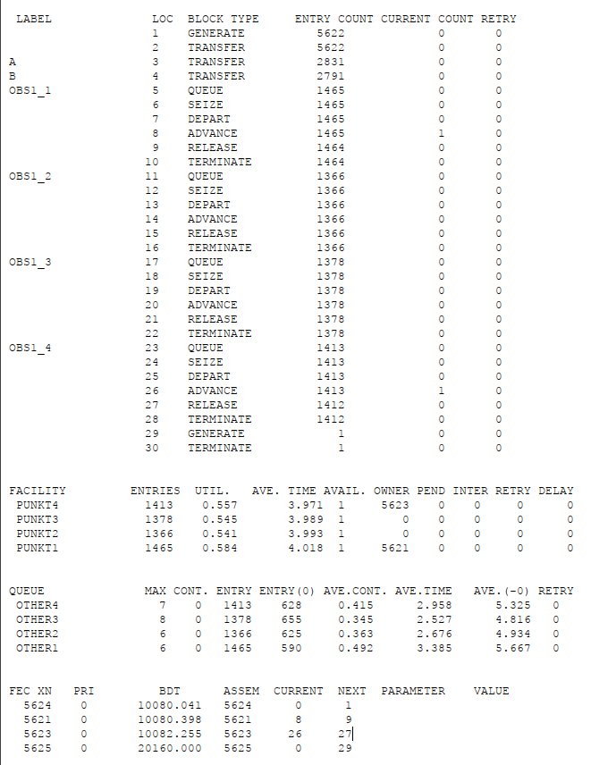

---
## Front matter
title: "Лабораторная работа 16"
subtitle:   "Задачи оптимизации. Модель двух стратегий обслуживания"
author: "Извекова Мария Петровна"

## Generic otions
lang: ru-RU
toc-title: "Содержание"

## Bibliography
bibliography: bib/cite.bib
csl: pandoc/csl/gost-r-7-0-5-2008-numeric.csl

## Pdf output format
toc: true # Table of contents
toc-depth: 2
lof: true # List of figures
lot: true # List of tables
fontsize: 12pt
linestretch: 1.5
papersize: a4
documentclass: scrreprt
## I18n polyglossia
polyglossia-lang:
  name: russian
  options:
	- spelling=modern
	- babelshorthands=true
polyglossia-otherlangs:
  name: english
## I18n babel
babel-lang: russian
babel-otherlangs: english
## Fonts
mainfont: IBM Plex Serif
romanfont: IBM Plex Serif
sansfont: IBM Plex Sans
monofont: IBM Plex Mono
mathfont: STIX Two Math
mainfontoptions: Ligatures=Common,Ligatures=TeX,Scale=0.94
romanfontoptions: Ligatures=Common,Ligatures=TeX,Scale=0.94
sansfontoptions: Ligatures=Common,Ligatures=TeX,Scale=MatchLowercase,Scale=0.94
monofontoptions: Scale=MatchLowercase,Scale=0.94,FakeStretch=0.9
mathfontoptions:
## Biblatex
biblatex: true
biblio-style: "gost-numeric"
biblatexoptions:
  - parentracker=true
  - backend=biber
  - hyperref=auto
  - language=auto
  - autolang=other*
  - citestyle=gost-numeric
## Pandoc-crossref LaTeX customization
figureTitle: "Рис."
listingTitle: "Листинг"
lofTitle: "Список иллюстраций"
lolTitle: "Листинги"
## Misc options
indent: true
header-includes:
  - \usepackage{indentfirst}
  - \usepackage{float} # keep figures where there are in the text
  - \floatplacement{figure}{H} # keep figures where there are in the text
---

# Цель работы

Построить  2 модели с двумя очередями обслуживания и с одной очередью обслуживания в gpss. обозначить оптимальное количество  пропускных пунктов.

# Задание

Построить модели:
1. модель с двумя очередями обсуживания
2. с одной очередью обслуживания 
3. Сделать сравнение двух моделей и обозначить оптимальное количество пропускных пунктов

# Постановка задачи

На пограничном контрольно-пропускном пункте транспорта имеются 2 пункта
пропуска. Интервалы времени между поступлением автомобилей имеют экспоненциальное распределение со средним значением µ. Время прохождения автомобилями
пограничного контроля имеет равномерное распределение на интервале [a, b].
Предлагается две стратегии обслуживания прибывающих автомобилей:
1) автомобили образуют две очереди и обслуживаются соответствующими пунктами
пропуска;
2) автомобили образуют одну общую очередь и обслуживаются освободившимся
пунктом пропуска.
Исходные данные: µ = 1, 75 мин, a = 1 мин, b = 7 мин

# Выполнение лабораторной работы

## Построение модели

Целью моделирования является определение:

характеристик качества обслуживания автомобилей, в частности, средних длин очередей; среднего времени обслуживания автомобиля; среднего времени пребывания автомобиля на пункте пропуска;
наилучшей стратегии обслуживания автомобилей на пункте пограничного контроля;
оптимального количества пропускных пунктов.
В качестве критериев, используемых для сравнения стратегий обслуживания автомобилей, выберем:

коэффициенты загрузки системы;
максимальные и средние длины очередей;
средние значения времени ожидания обслуживания.
Для первой стратегии обслуживания, когда прибывающие автомобили образуют две очереди и обслуживаются соответствующими пропускными пунктами, имеем следующую модель (рис. [-@fig:001]).

{#fig:001 width=70%}

После запуска симуляции получим отчёт (рис. [-@fig:002]).

{#fig:002 width=70%}

{#fig:003 width=70%}

Составим модель для второй стратегии обслуживания, когда прибывающие автомобили образуют одну очередь и обслуживаются освободившимся пропускным пунктом (рис. [-@fig:004], [-@fig:005]).

{#fig:004 width=70%}

{#fig:005 width=70%}

Составим таблицу по полученной статистике (табл. [-@tbl:strategy]).

: Сравнение стратегий {#tbl:strategy}:

| Показатель                  | стратегия 1 пункт 1 | стратегия 1 пункт 2 | стратегия 1 в целом | стратегия 2   |
|----------------------------|---------------------|---------------------|---------------------|----------------|
| Поступило автомобилей      | 2928                | 2925                | 5853                | 5719           |
| Обслужено автомобилей      | 2540                | 2536                | 5076                | 5049           |
| Коэффициент загрузки       | 0,997               | 0,996               | 0,9965              | 1              |
| Максимальная длина очереди| 393                 | 393                 | 786                 | 668            |
| Средняя длина очереди      | 187,098             | 187,114             | 374,212             | 344,466        |
| Среднее время ожидания     | 644,107             | 644,823             | 644,465             | 607,138        |

Сравнив результаты моделирования двух систем, можно сделать вывод о том, что первая модель позволяет обслужить большее число автомобилей. Однако мы видим, что разница между обслуженными и поступившими автомобилями меньше для второй модели – значит, продуктивность работы выше. Также для второй модели коэффициент загрузки равен 1 -- значит ни один из пунктов не простаивает. Максимальная длина очереди, средняя длина очереди и среднее время ожидания меньше для второй стратегии. Можно сделать вывод, что вторая стратегия лучше.

## Оптимизация модели двух стратегий обслуживания

Изменим модели, чтобы определить оптимальное число пропускных пунктов (от 1 до 4). Будем подбирать под следующие критерии:

коэффициент загрузки пропускных пунктов принадлежит интервалу [0, 5; 0, 95];
среднее число автомобилей, одновременно находящихся на контрольно пропускном пункте, не должно превышать 3;
среднее время ожидания обслуживания не должно превышать 4 мин.
Для обеих стратегий модель с одним пунктом выглядит одинаково (рис. [-@fig:006]).

{#fig:006 width=70%}

После симуляции получим следующий отчет (рис. [-@fig:007]).

{#fig:007 width=70%}

В этом случае модель не проходит ни по одному из критериев, так как коэффициент загрузки, размер очереди и среднее время ожидания больше.

Построим модель для первой стратегии с 3 пропускными пунктами и получим отчет (рис. [-@fig:008]- [-@fig:010]).

{#fig:008 width=70%}

{#fig:009 width=70%}

{#fig:010 width=70%}

В этом случае среднее количество автомобилей в очереди меньше 3 и коэффициент загрузки в нужном диапазоне, но среднее время ожидания больше 4.

Построим модель для первой стратегии с 4 пропускными пунктами (рис. [-@fig:011], [-@fig:013]).

{#fig:011 width=70%}

{#fig:012 width=70%}

{#fig:013 width=70%}

В этом случае все критерии выполнены, поэтому 4 пункта являются оптимальным количеством для первой стратегии.

Построим модель для второй стратегии с 3 пропускными пунктами и получим отчет (рис. [-@fig:014], [-@fig:015]).

{#fig:014 width=70%}

{#fig:015 width=70%}

В этом случае все критерии выполняются, поэтому модель оптимальна.

Построим модель для второй стратегии с 4 пропускными пунктами и получим отчет (рис. [-@fig:016], [-@fig:017]).

{#fig:016 width=70%}

{#fig:017 width=70%}

Здесь все критерии выполнены при этом время ожидания и среднее число автомобилей меньше, чем в случе второй стратегии с 3 пунктами, однако и загрузка меньше. Можно сделать вывод, что 4 пропускной пункт излишне разгружает систему.

В результате анализа наилучшим количеством пропускных пунктов будет 3 при втором типе обслуживания и 4 при первом.

# Выводы
В результате была реализована с помощью gpss:

1. модель с двумя очередями обсуживания
2. с одной очередью обслуживания 
3. Сделать сравнение двух моделей и обозначить оптимальное количество пропускных пунктов

# Библиография

1. Королькова А. В., Кулябов Д. С. Модели обработки заказов

2. Королькова А. В., Кулябов Д. С. Имитационное моделирование в GPSS

