---
## Front matter
lang: ru-RU
title:  "Лабораторная работа  17"
subtitle:  "Задания для самстоятельного выполнения"
author:
  - Извекова Мария Петровна
institute:
  - Российский университет дружбы народов, Москва, Россия
date: 17 мая 2025

## i18n babel
babel-lang: russian
babel-otherlangs: english

## Formatting pdf
toc: false
toc-title: Содержание
slide_level: 2
aspectratio: 169
section-titles: true
theme: metropolis
header-includes:
 - \metroset{progressbar=frametitle,sectionpage=progressbar,numbering=fraction}
---

# Докладчик

:::::::::::::: {.columns align=center}
::: {.column width="70%"}

  * Извекова Мария Петровна
  * студентка 3-го курса
  * Российский университет дружбы народов
  * [1132226460@pfur.ru](mailto:1132226460@pfur.ru)

:::
::: {.column width="30%"}

:::
::::::::::::::

# Цель работы

Построить 3 модели в gpss  и проанализировать их 

# Задание

Построить модели:
1. Моделирование работы вычислительного центра
2. Модель работы аэропорта
3. Моделирование работы морского порта

# Выполнение лабораторной работы

## Постановка задачи 1

На вычислительном центре в обработку принимаются три класса заданий А, В и С.
Исходя из наличия оперативной памяти ЭВМ задания классов А и В могут решаться
одновременно, а задания класса С монополизируют ЭВМ. Задания класса А поступают через 20 ± 5 мин, класса В — через 20 ± 10 мин, класса С — через 28 ± 5 мин
и требуют для выполнения: класс А — 20 ± 5 мин, класс В — 21 ± 3 мин, класс
С — 28 ± 5 мин. Задачи класса С загружаются в ЭВМ, если она полностью свободна.
Задачи классов А и В могут дозагружаться к решающей задаче.
Смоделировать работу ЭВМ за 80 ч. Определить её загрузку.

# Моделирование работы вычислительного центра

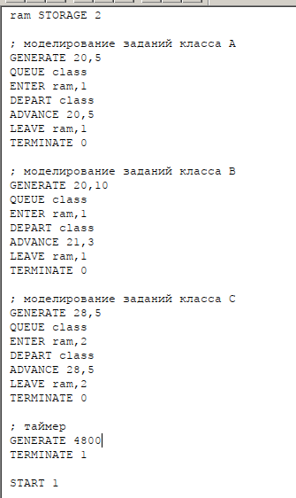{#fig:001 width=70%}

#

::: columns
::: column
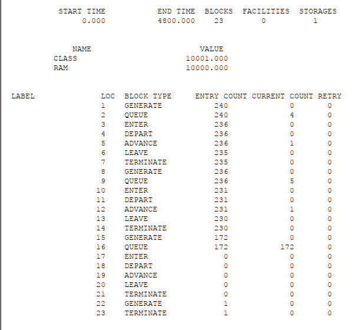{#fig:002 width=60%}
:::

::: column
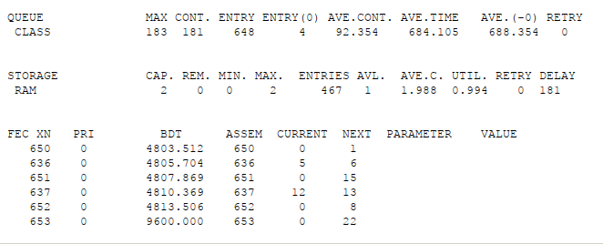{#fig:003 width=60%}
::: 
:::

# Постановка задачи 2

Самолёты прибывают для посадки в район аэропорта каждые 10 ± 5 мин. Если
взлетно-посадочная полоса свободна, прибывший самолёт получает разрешение на
посадку. Если полоса занята, самолет выполняет полет по кругу и возвращается
в аэропорт каждые 5 мин. Если после пятого круга самолет не получает разрешения
на посадку, он отправляется на запасной аэродром.
В аэропорту через каждые 10 ± 2 мин к взлетно-посадочной полосе выруливают
готовые к взлёту самолёты и получают разрешение на взлёт, если полоса свободна.
Для взлета и посадки самолёты занимают полосу ровно на 2 мин. Если при свободной
полосе одновременно один самолёт прибывает для посадки, а другой — для взлёта,
то полоса предоставляется взлетающей машине.

# Модель работы аэропорта

{#fig:004 width=70%}

#

::: columns
::: column
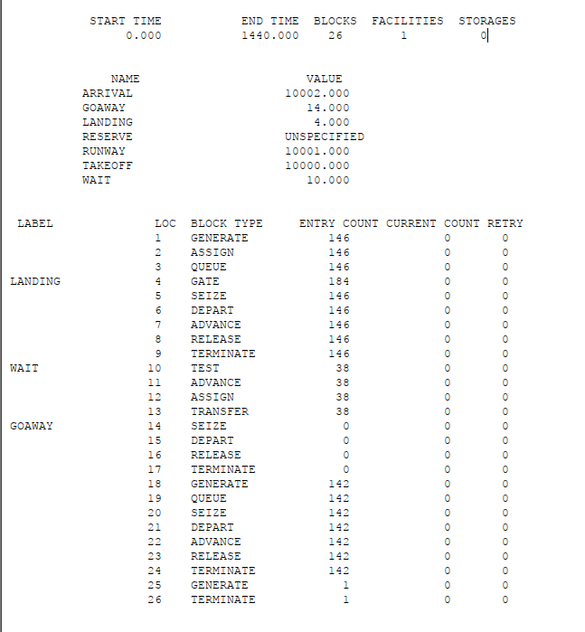{#fig:005 width=70%}
:::

::: column
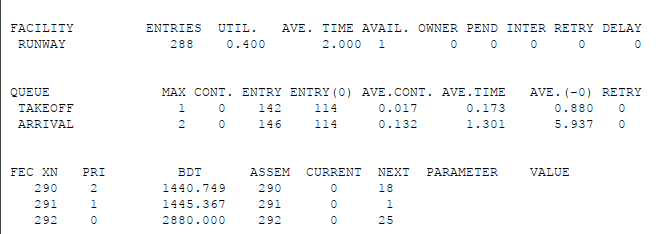{#fig:006 width=70%}
::: 
:::

# Постановка задачи 3

Морские суда прибывают в порт каждые [a ± δ] часов. В порту имеется N причалов.
Каждый корабль по длине занимает M причалов и находится в порту [b ± ε] часов.
Требуется построить GPSS-модель для анализа работы морского порта в течение
полугода, определить оптимальное количество причалов для эффективной работы
порта.
Исходные данные:
1) a = 20 ч, δ = 5 ч, b = 10 ч, ε = 3 ч, N = 10, M = 3;
2) a = 30 ч, δ = 10 ч, b = 8 ч, ε = 4 ч, N = 6, M = 2.

# Моделирование работы морского порта

## Первый вариант модели

::: columns
::: column
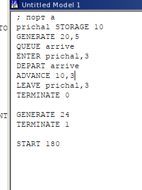{#fig:007 width=60%}
:::

::: column
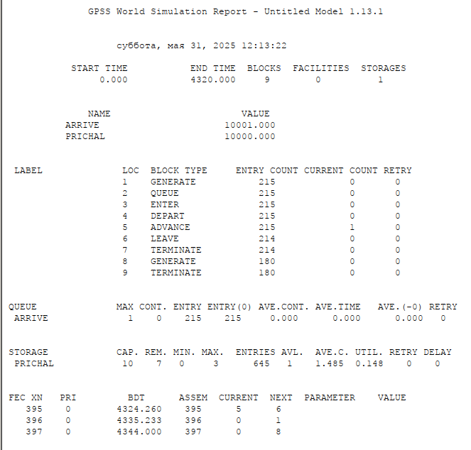{#fig:008 width=60%}
::: 
:::

#

::: columns
::: column
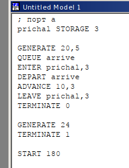{#fig:009 width=70%}
:::

::: column
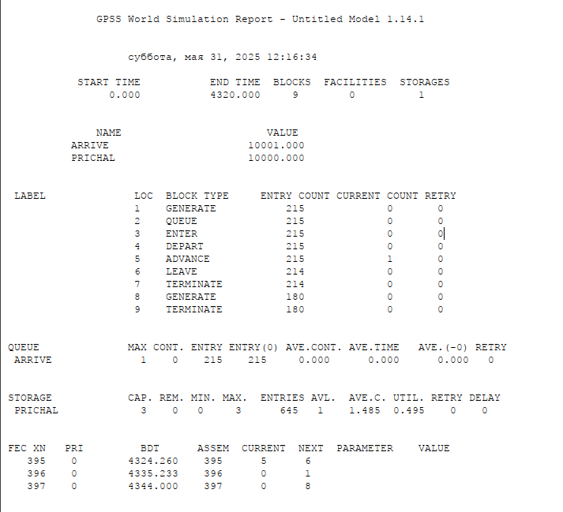{#fig:010 width=70%}
::: 
:::

# Второй вариант модели

::: columns
::: column
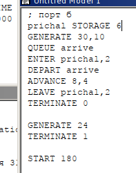{#fig:011 width=70%}
:::

::: column
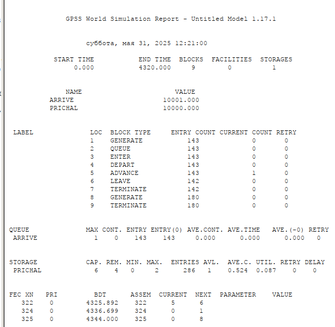{#fig:012 width=70%}
::: 
:::

#

::: columns
::: column
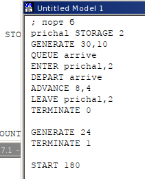{#fig:013 width=70%}
:::

::: column
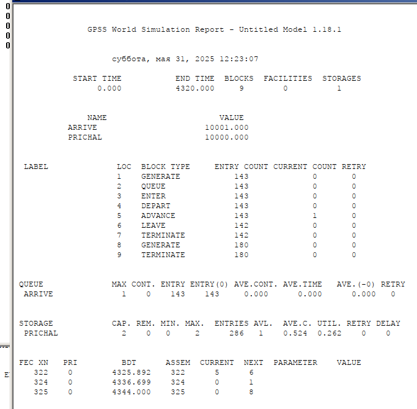{#fig:014 width=70%}
::: 
:::

# Выводы
В результате была реализована с помощью gpss и проанализированы:

1. Моделирование работы вычислительного центра
2. Модель работы аэропорта
3. Моделирование работы морского порта

# Библиография

1. Королькова А. В., Кулябов Д. С. Модели обработки заказов

2. Королькова А. В., Кулябов Д. С. Имитационное моделирование в GPSS

