---
## Front matter
lang: ru-RU
title: "Лабораторная работа 5"
subtitle: "Модель хищник-жертва"
author:
  - Извекова Мария Петровна
institute:
  - Российский университет дружбы народов, Москва, Россия
date: 11 апрель 2025

## i18n babel
babel-lang: russian
babel-otherlangs: english

## Formatting pdf
toc: false
toc-title: Содержание
slide_level: 2
aspectratio: 169
section-titles: true
theme: metropolis
header-includes:
 - \metroset{progressbar=frametitle,sectionpage=progressbar,numbering=fraction}
---

# Докладчик

:::::::::::::: {.columns align=center}
::: {.column width="70%"}

  * Извекова Мария Петровна
  * студентка 3-го курса
  * Российский университет дружбы народов
  * [1132226460@pfur.ru](mailto:1132226460@pfur.ru)

:::
::: {.column width="30%"}

:::
::::::::::::::

# Цели и задачи

Построить модель SIR в xcos и OpenModelica.

# Задание

1. Реализовать модель SIR в в xcos;
2. Реализовать модель SIR с помощью блока Modelica в в xcos;
3. Реализовать модель SIR в OpenModelica;
4. Реализовать модель SIR с учётом процесса рождения / гибели особей в xcos (в том числе и с использованием блока Modelica), а также в OpenModelica;
5. Построить графики эпидемического порога при различных значениях параметров модели (в частности изменяя параметр μ);
6. Сделать анализ полученных графиков в зависимости от выбранных значений параметров модели.

# Выполнение лабораторной работы

$$
\begin{cases}
\dot{s}(t) = -\beta s(t) i(t), \\
\dot{i}(t) = \beta s(t) i(t) - \nu i(t), \\
\dot{r}(t) = \nu i(t)
\end{cases}
$$

где β - скорость распространения, ν - скорость выздоравления

#

Зафиксируем начальные данные: β = 1  ν = .3 s(0)=0.999, r(0)=0, i(0)=0.001
В меню Моделирование, Установить контекст зададим значения переменных β и ν(рис. [-@fig:001]).

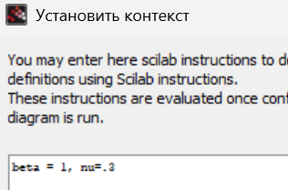{#fig:001 width=70%}

#

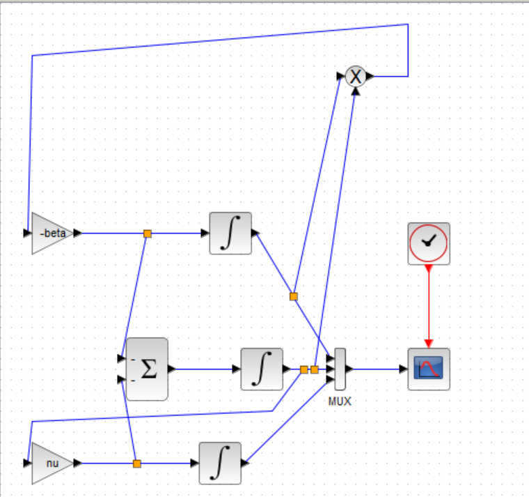{#fig:002 width=70%}

#

::: columns
:::: column
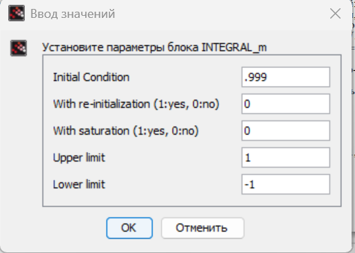{#fig:003 width=70%}
::::

:::: column
{#fig:004 width=70%}
::::
::::

#

::: columns
:::: column
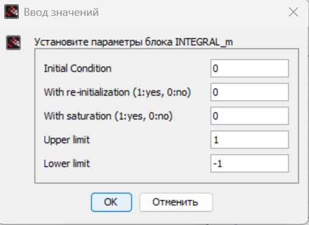{#fig:005 width=70%}
::::

:::: column
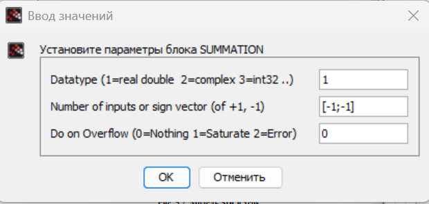{#fig:006 width=70%}
::::
::::

#

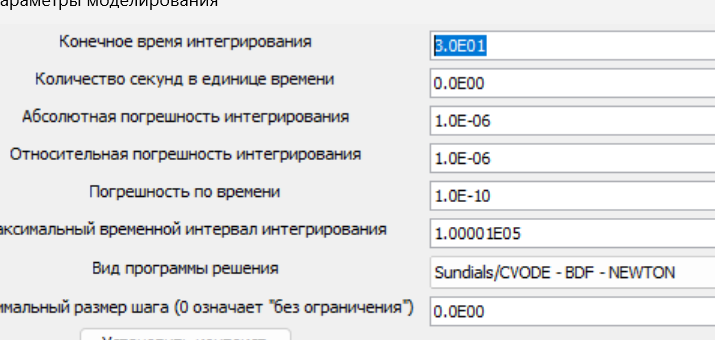{#fig:007 width=70%}

#

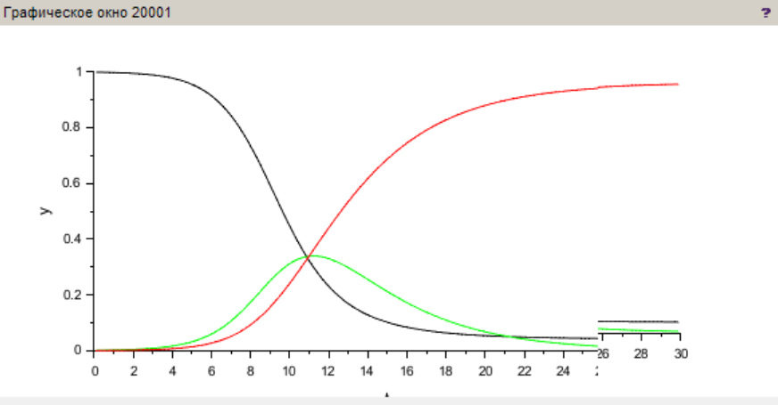{#fig:008 width=70%}

# Реализация модели с помощью блока Modelica в xcos

::: columns
:::: column
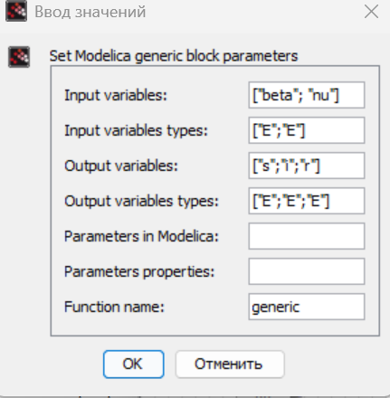{#fig:010 width=70%}
::::

:::: column
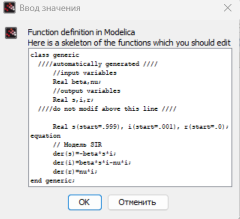{#fig:011 width=70%}
::::
::::

#

{#fig:012 width=70%}

# Упражнение

modelica parameter Real I_0 = 0.001; parameter Real R_0 = 0; parameter Real S_0 = 0.999; parameter Real beta = 1; parameter Real nu = 0.3; Real s(start=S_0); Real i(start=I_0); Real r(start=R_0); equation der(s) = -beta * s * i; der(i) = beta * s * i - nu * i; der(r) = nu * i; 

#

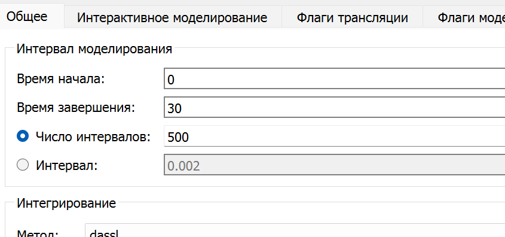{#fig:013 width=70%}

#

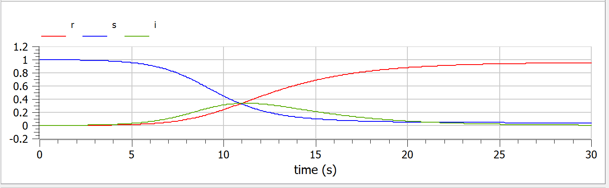{#fig:014 width=70%}

# Задание для самостоятельного выполнения

$$
\begin{cases}
\dot{s}(t) = -\beta s(t) i(t) + \mu \left(N - s(t)\right), \\
\dot{i}(t) = \beta s(t) i(t) - \nu i(t) - \mu i(t), \\
\dot{r}(t) = \nu i(t) - \mu r(t)
\end{cases}
$$

#

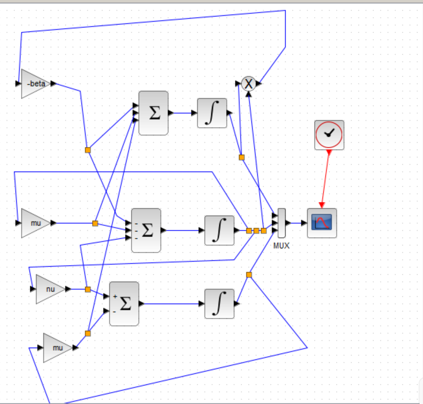{#fig:015 width=70%}

#

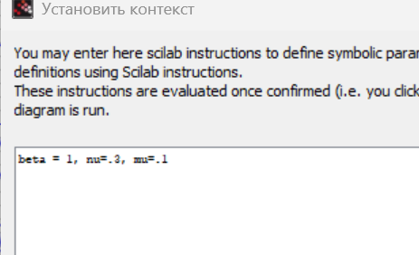{#fig:016 width=70%}

#

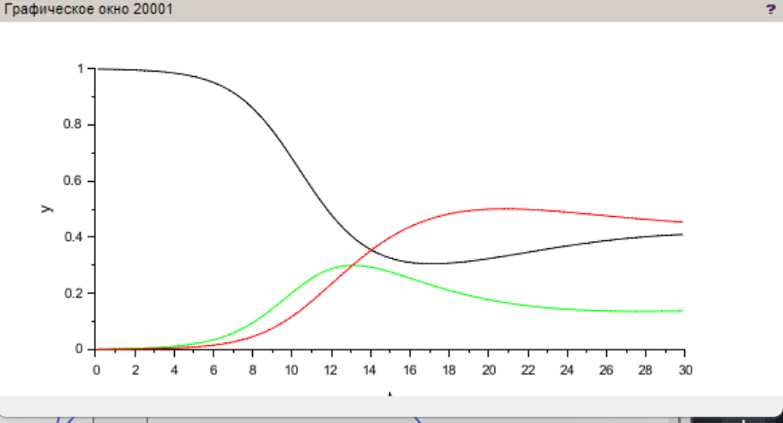{#fig:017 width=70%}

#

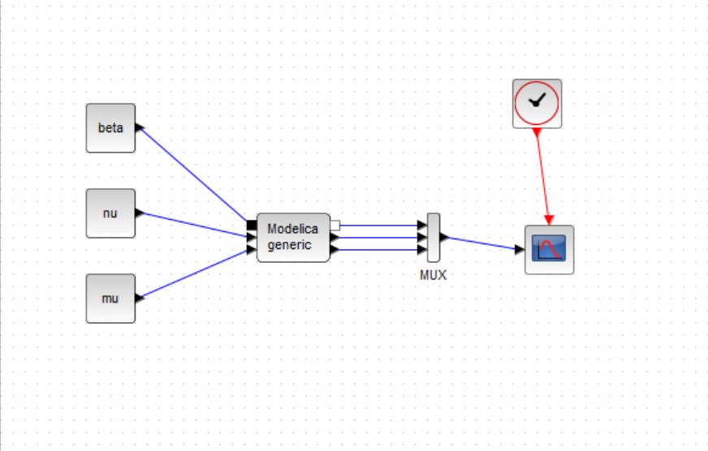{#fig:018 width=70%}

#

::: columns
:::: column
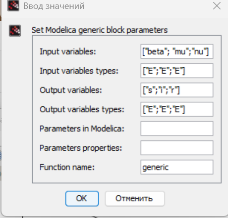{#fig:019 width=70%}
::::

:::: column
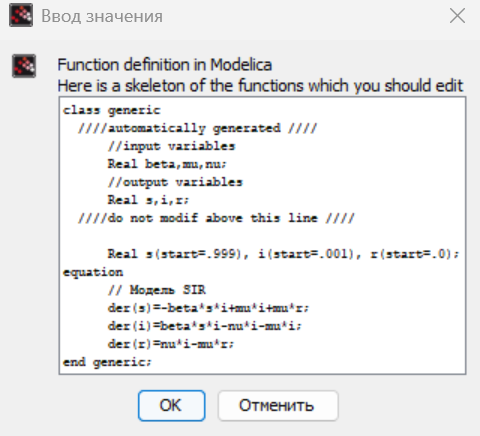{#fig:020 width=70%}
::::
::::

#

{#fig:021 width=40%}

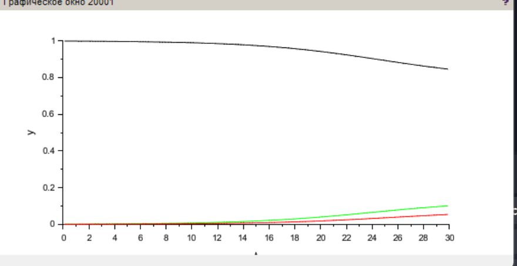{#fig:022 width=40%}

#

modelica parameter
Real I_0 = 0.001; 
parameter Real R_0 = 0;
parameter Real S_0 = 0.999;
parameter Real N = 1; 
parameter Real beta = 1;
parameter Real nu = 0.3;
parameter Real mu = 0.5;
Real s(start=S_0);
Real i(start=I_0);
Real r(start=R_0);
equation der(s) = -beta * s * i + mu * i + mu * r;
der(i) = beta * s * i - nu * i - mu * i;
der(r) = nu * i - mu * r; 

#

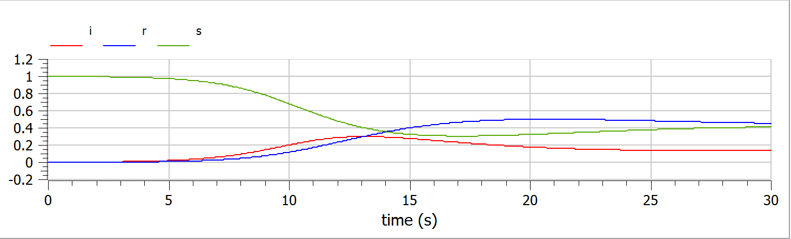{#fig:023 width=70%}

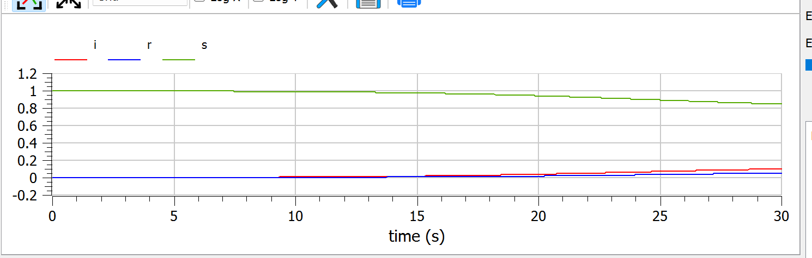{#fig:024 width=70%}

# Вывод

В процессе выполнения данной лабораторной работы была построена модель SIR в xcos и OpenModelica

