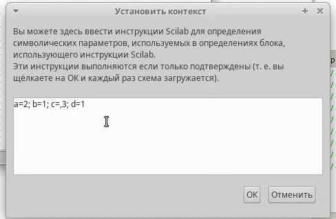
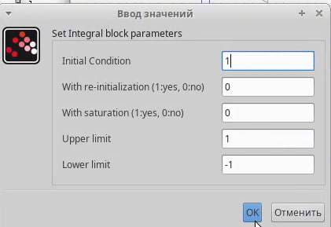
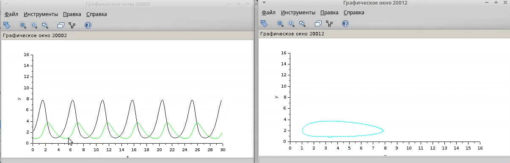
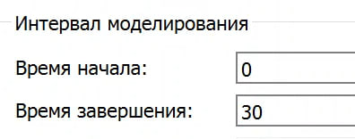
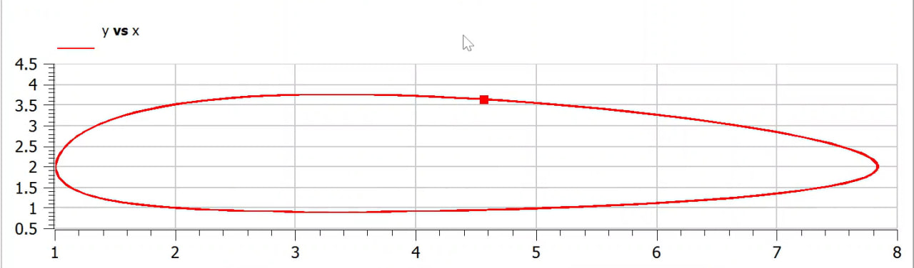

---
## Front matter
lang: ru-RU
title: Лабораторная работа 6
subtitle: "Модель хищник-жертва"
author:
  - Извекова Мария Петровна
institute:
  - Российский университет дружбы народов, Москва, Россия
date: 22 февраля 2025

## i18n babel
babel-lang: russian
babel-otherlangs: english

## Formatting pdf
toc: false
toc-title: Содержание
slide_level: 2
aspectratio: 169
section-titles: true
theme: metropolis
header-includes:
 - \metroset{progressbar=frametitle,sectionpage=progressbar,numbering=fraction}
---

# Докладчик

:::::::::::::: {.columns align=center}
::: {.column width="70%"}

  * Извекова Мария Петровна
  * студентка 3-го курса
  * Российский университет дружбы народов
  * [1132226460@pfur.ru](mailto:1132226460@pfur.ru)

:::
::: {.column width="30%"}

:::
::::::::::::::

# Цели и задачи

Реализовать модель "хищник-жертва" в xcos.

1. Реализовать модель "хищник-жертва" в xcos;
2. Реализовать модель "хищник-жертва" с помощью блока Modelica generic в xcos;
3. Реализовать модель "хищник-жертва" в OpenModelica

# Выполнение лабораторной работы

Модель «хищник–жертва» (модель Лотки — Вольтерры) представляет собой модель межвидовой конкуренции. В математической форме модель имеет вид:

$$
\begin{cases}
\dot{x} = ax - bxy \\
\dot{y} = cxy - dy
\end{cases}
$$

где x — количество жертв; y — количество хищников; a,b , c,d — коэффициенты, отражающие взаимодействия между видами: a— коэффициент рождаемости жертв; b — коэффициент убыли жертв; c— коэффициент рождения хищников; d— коэффициент убыли хищников.

#

Зафиксируем начальные данные: a = 2, b = 1, c = 0, 3, d = 1, x(0) = 2, y(0) = 1.
В меню Моделирование, Задать переменные окружения зададим значения коэффициентов a, b, c, d  (рис. [-@fig:001]).

{#fig:001 width=60%}

#

Для реализации модели в дополнение к блокам CLOCK_c, CSCOPE, TEXT_f, MUX, INTEGRAL_m, GAINBLK_f, SUMMATION, PROD_f потребуется

{#fig:002 width=60%}

#

Готовая модель «хищник–жертва» представлена на рис. (рис. [-@fig:002]).

{#fig:003 width=60%}

#

В параметрах блоков интегрирования необходимо задать начальные значения x(0) = 2, y(0) = 1 

::: columns
:::: column
{#fig:004 width=60%}
::::

:::: column
{#fig:005 width=60%}
::::
::::

#

В меню Моделирование, Установка необходимо задать конечное время интегрирования, равным времени моделирования: 30.

{#fig:006 width=60%}

#

Результаты моделирования представлен на рис (рис. [-@fig:007])

{#fig:007 width=70%}

# Реализация модели с помощью блока Modelica в xcos

Для реализации модели (рис. [-@fig:002]) с помощью языка Modelica потребуются следующие
блоки xcos: CLOCK_c, CSCOPE, CSCOPXY, TEXT_f, MUX, CONST_m и MBLOCK (Modelica
generic).

{#fig:008 width=70%}

#

Как и ранее, задаём значения коэффициентов a, b, c, d. Параметры блока Modelica представлены на (рис. [-@fig:010]) . Переменные на входе (“a”,
“b”, “c”, “d”) и выходе (“x”, “y”) блока заданы как внешние (“E”).

::: columns
:::: column
{#fig:009 width=60%}
::::

:::: column
{#fig:010 width=60%}
::::
::::

#

class generic
////automatically generated ////
//input variables
Real a,b,c,d;
//output variables
// Real x,y;
////do not modif above this line ////
Real x(start=2), y(start=1);
// Модель хищник-жертва
equation
der(x) = a*x - b*x*y;
der(y) = c*x*y - d*y;
end generic;

#

Готовая модель «хищник–жертва» представлена на рис.  [-@fig:011]

{#fig:011 width=70%}

#

Результат второго моделирования представлен на рис (рис. [-@fig:012])

{#fig:012 width=70%}

# Реализовать модель "хищник-жертва" в OpenModelica

Реализуем модель «хищник – жертва» в OpenModelica. Построим графики изменения численности популяций и фазовый портрет.

{#fig:012 width=70%}

#

Выполним симуляцию, поставим конечное время 30с. Получим график изменения численности хищников и жертв (рис. [-@fig:014]), а также фазовый портрет (рис. [-@fig:015]).

{#fig:013 width=70%}

#

::: columns
:::: column
{#fig:014 width=70%}
::::

:::: column
{#fig:015 width=70%}
::::
::::

# Вывод

В процессе выполнения данной лабораторной реализована модель "хищник-жертва" в xcos.
