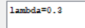
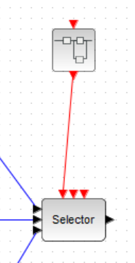
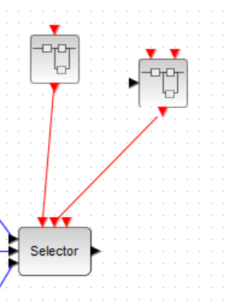
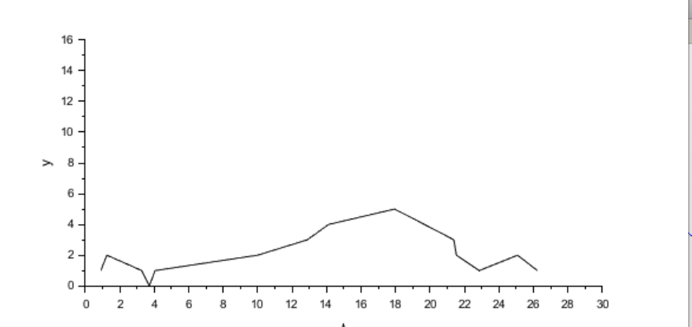

---
## Front matter
lang: ru-RU
title: Лабораторная работа 7
subtitle: "Модель M|M|1|"
author:
  - Извекова Мария Петровна
institute:
  - Российский университет дружбы народов, Москва, Россия
date: 22 февраля 2025

## i18n babel
babel-lang: russian
babel-otherlangs: english

## Formatting pdf
toc: false
toc-title: Содержание
slide_level: 2
aspectratio: 169
section-titles: true
theme: metropolis
header-includes:
 - \metroset{progressbar=frametitle,sectionpage=progressbar,numbering=fraction}
---

# Докладчик

:::::::::::::: {.columns align=center}
::: {.column width="70%"}

  * Извекова Мария Петровна
  * студентка 3-го курса
  * Российский университет дружбы народов
  * [1132226460@pfur.ru](mailto:1132226460@pfur.ru)

:::
::: {.column width="30%"}

:::
::::::::::::::

# Цель работы

Рассмотреть пример моделирования в xcos системы массового обслуживания типа M|M|1|∞.

# Задание

1. Реализовать модель системы массового обслуживания типа M|M|1|∞.

2. Построить график поступления и обработки заявок;
3. Построить график динамики размера очереди.

# Выполнение лабораторной работы

| {#fig:001 width=30%} | {#fig:002 width=30%} | {#fig:003 width=30%}

#

::: columns
::: column
{#fig:004 width=60%}
::::

::: column
{#fig:005 width=40%}
::: 
:::

#

::: columns
::: column
{#fig:006 width=60%}
::::

::: column
{#fig:007 width=40%}
::: 
:::

#

{#fig:008 width=45%}

#

|{#fig:009 width=30%} | {#fig:010 width=30%} | {#fig:011 width=30%}

#

::: columns
::: column
{#fig:012 width=40%}
::::

::: column
{#fig:013 width=40%}
:::
:::

# Вывод

В процессе выполнения данной лабораторной работы я рассмотрела пример моделирования в xcos системы массового обслуживания типа M|M|1|∞.