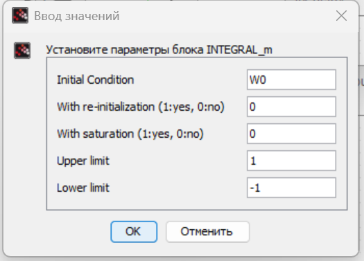
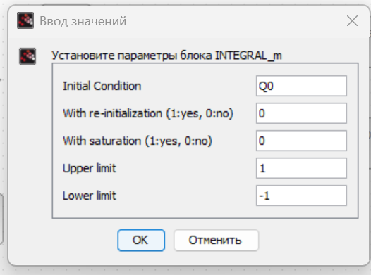
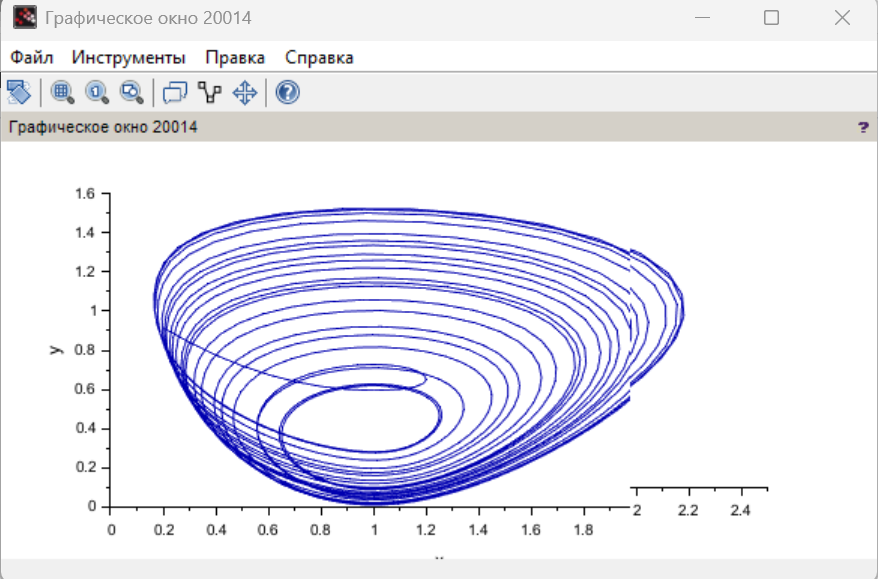
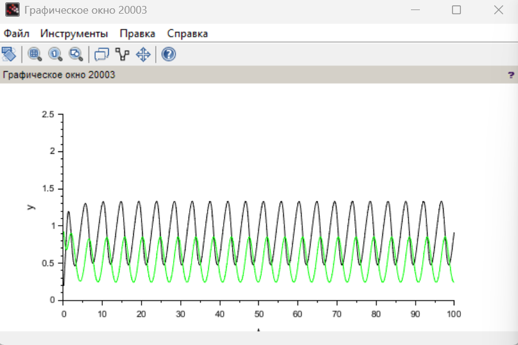
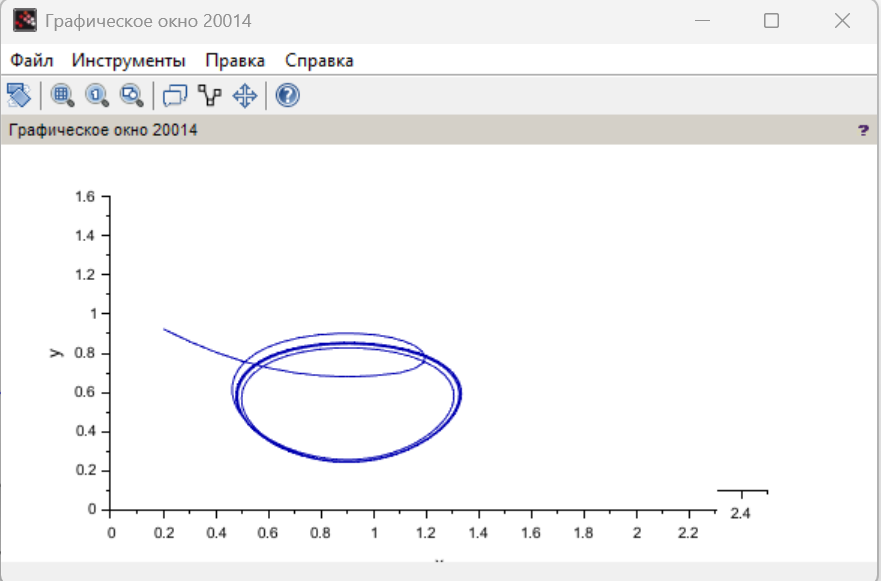
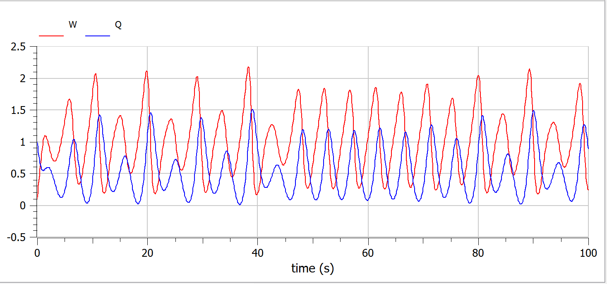

---
## Front matter
lang: ru-RU
title:  "Лабораторная работа 8"
subtitle: "Модель TCP/AQM"
author:
  - Извекова Мария Петровна
institute:
  - Российский университет дружбы народов, Москва, Россия
date: 29 марта 2025

## i18n babel
babel-lang: russian
babel-otherlangs: english

## Formatting pdf
toc: false
toc-title: Содержание
slide_level: 2
aspectratio: 169
section-titles: true
theme: metropolis
header-includes:
 - \metroset{progressbar=frametitle,sectionpage=progressbar,numbering=fraction}
---

# Докладчик

:::::::::::::: {.columns align=center}
::: {.column width="70%"}

  * Извекова Мария Петровна
  * студентка 3-го курса
  * Российский университет дружбы народов
  * [1132226460@pfur.ru](mailto:1132226460@pfur.ru)

:::
::: {.column width="30%"}

:::
::::::::::::::

# Цель работы

Цель данной лабораторной работы -- реализовать модель TCP/AQM с помощью xcos и OpenModelica.

# Задание

1. Реализовать в xcos и OpenModelica модель TCP/AQM.
2. Построить график, описывающий динамику размера очереди и TCP окна
3. Построить фазовый портрет, описывающий зависимость размера очереди от TCP окна

# Выполнение лабораторной работы

::: columns
::: column
{#fig:001 width=70%}
:::

::: column
{#fig:002 width=70%}|
::: 
:::

#

::: columns
::: column
{#fig:003 width=70%}
::::

::: column
{#fig:004 width=70%}
::: 
:::

#

{#fig:005 width=70%}

#

{#fig:006 width=70%}

#

::: columns
::: column
{#fig:007 width=70%}
::::

::: column
{#fig:008 width=70%}
::: 
:::

#

{#fig:009 width=70%}

#

::: columns
::: column
{#fig:010 width=70%}
::::

::: column
{#fig:011 width=70%}
::: 
:::

#

{#fig:012 width=70%}

#
::: columns
::: column
{#fig:013 width=70%}
::::

::: column
{#fig:014 width=70%}
::: 
:::

#  OpenModelica

{#fig:015 width=70%}

#
::: columns
::: column
{#fig:017 width=70%}
::::

::: column
{#fig:018 width=70%}
::: 
:::

# Измененная скорость обработки пакетов
::: columns
::: column
{#fig:019 width=70%}
::::

::: column
{#fig:020 width=70%}
::: 
:::

# Выводы

При выполнении данной лабораторной работы я реализовала модель TCP/AQM с помощью xcos и OpenModelica.

# Список литературы

1. OpenModelica. — URL: https://www.openmodelica.org/.
2. Xcos. — URL: https://www.scilab.org/software/xcos.
3. 1. Братусь А. С., Новожилов Артем Сергеевич abd Платонов А. П. Динамические системы и модели биологии. — М. : ФИЗМАТЛИТ, 2010. — 400 с.
