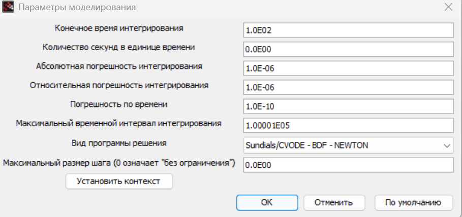

---
## Front matter
title: "Лабораторная работа 8"
subtitle:   "Модель TCP/AQM"
author: "Извекова Мария Петровна"

## Generic otions
lang: ru-RU
toc-title: "Содержание"

## Bibliography
bibliography: bib/cite.bib
csl: pandoc/csl/gost-r-7-0-5-2008-numeric.csl

## Pdf output format
toc: true # Table of contents
toc-depth: 2
lof: true # List of figures
lot: true # List of tables
fontsize: 12pt
linestretch: 1.5
papersize: a4
documentclass: scrreprt
## I18n polyglossia
polyglossia-lang:
  name: russian
  options:
	- spelling=modern
	- babelshorthands=true
polyglossia-otherlangs:
  name: english
## I18n babel
babel-lang: russian
babel-otherlangs: english
## Fonts
mainfont: IBM Plex Serif
romanfont: IBM Plex Serif
sansfont: IBM Plex Sans
monofont: IBM Plex Mono
mathfont: STIX Two Math
mainfontoptions: Ligatures=Common,Ligatures=TeX,Scale=0.94
romanfontoptions: Ligatures=Common,Ligatures=TeX,Scale=0.94
sansfontoptions: Ligatures=Common,Ligatures=TeX,Scale=MatchLowercase,Scale=0.94
monofontoptions: Scale=MatchLowercase,Scale=0.94,FakeStretch=0.9
mathfontoptions:
## Biblatex
biblatex: true
biblio-style: "gost-numeric"
biblatexoptions:
  - parentracker=true
  - backend=biber
  - hyperref=auto
  - language=auto
  - autolang=other*
  - citestyle=gost-numeric
## Pandoc-crossref LaTeX customization
figureTitle: "Рис."
tableTitle: "Таблица"
listingTitle: "Листинг"
lofTitle: "Список иллюстраций"
lotTitle: "Список таблиц"
lolTitle: "Листинги"
## Misc options
indent: true
header-includes:
  - \usepackage{indentfirst}
  - \usepackage{float} # keep figures where there are in the text
  - \floatplacement{figure}{H} # keep figures where there are in the text
---

# Цель работы

Цель данной лабораторной работы -- реализовать модель TCP/AQM с помощью xcos и OpenModelica.

# Задание

1. Реализовать в xcos и OpenModelica модель TCP/AQM.
2. Построить график, описывающий динамику размера очереди и TCP окна
3. Построить фазовый портрет, описывающий зависимость размера очереди от TCP окна

# Выполнение лабораторной работы

Построим схему xcos [@xcos:bash], моделирующую нашу систему, с начальными значениями параметров 
N = 1; R = 1; K = 5.3; C = 1; W0 = 0.1; Q0 = 1

Зададим переменные окружения (рис. [-@fig:001]).

{#fig:001 width=70%}

Зададим время моделирования как 100 единиц модельного времени (рис. [-@fig:002]).

{#fig:002 width=70%}

Начальные значения в блоках интегрирования (рис. [-@fig:003], [-@fig:004]).

{#fig:003 width=70%}

{#fig:004 width=70%}

Установка параметра задержки (рис. [-@fig:005]).

{#fig:005 width=70%}

Запись выражения Q(t) в блок Expression (рис. [-@fig:006]).

{#fig:006 width=70%}

Установим параметры регистрирующих устройств для оптимального отображения графиков
В блоке CSCOPE ставим параметр refresh period=100, чтобы на графики отобразились результаты моделирования в течение 100 секунд модельного времени 
(рис. [-@fig:007], [-@fig:008]).

{#fig:007 width=70%}

{#fig:008 width=70%}

hеализуем модель TCP/AQM и разместим регистрирующие устройства CSCOPE для графиков изменения окна TCP и изменения очереди, и CSCOPXY для фазового портрета (рис. [-@fig:009]).

{#fig:009 width=70%}

Получаем динамику изменения размера TCP окна-зеленая линия и размера очереди -черная линия, а также фазовый портрет, который показывает наличие автоколебаний параметров системы  (рис. [-@fig:010], [-@fig:011]):

{#fig:010 width=70%}

{#fig:011 width=70%}

Уменьшаем скорость обработки пакетов C до 0.9 (рис. [-@fig:012]) увидим, что автоколебания стали четкими (рис. [-@fig:013], [-@fig:014]).

{#fig:012 width=70%}

{#fig:013 width=70%}

{#fig:014 width=70%}

Реализуем данные портреты в OpenModelica

Зафиксируем начальные данные (рис. [-@fig:015])

{#fig:015 width=70%}

Установим модельное время и число интервалов (рис. [-@fig:016])

{#fig:016 width=70%}

Получаем динамику изменения размера TCP окна-синия линия и размера очереди -красная линия, а также фазовый портрет, который показывает наличие автоколебаний параметров системы  (рис. [-@fig:017], [-@fig:018]):

{#fig:017 width=70%}

{#fig:018 width=70%}

При изменение скорости обработки пакетов С до 0.9 увидим четкие автоколебания

{#fig:019 width=70%}

{#fig:020 width=70%}

# Выводы

При выполнении данной лабораторной работы я реализовала модель TCP/AQM с помощью xcos и OpenModelica.

# Список литературы

1. OpenModelica. — URL: https://www.openmodelica.org/.
2. Xcos. — URL: https://www.scilab.org/software/xcos.
3. 1. Братусь А. С., Новожилов Артем Сергеевич abd Платонов А. П. Динамические системы и модели биологии. — М. : ФИЗМАТЛИТ, 2010. — 400 с.

